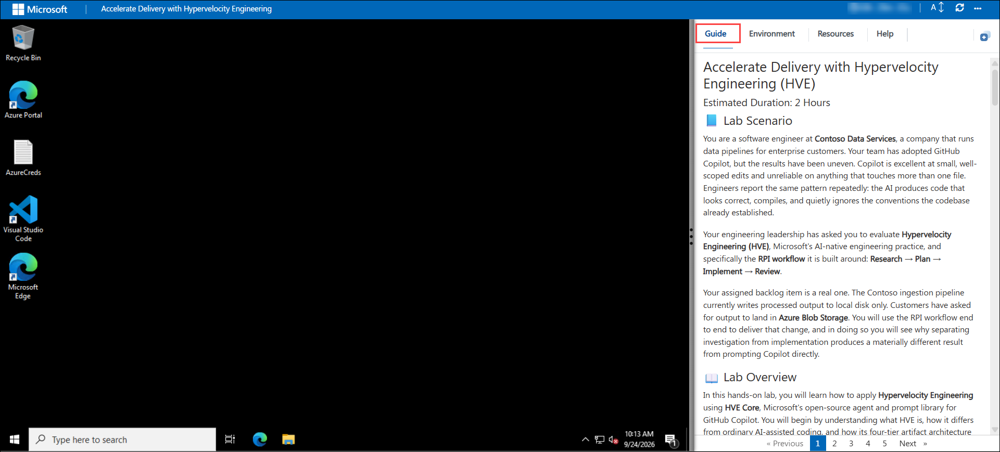
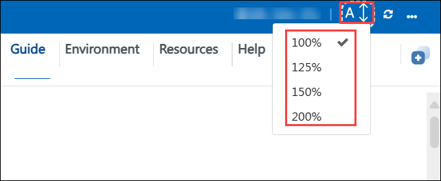
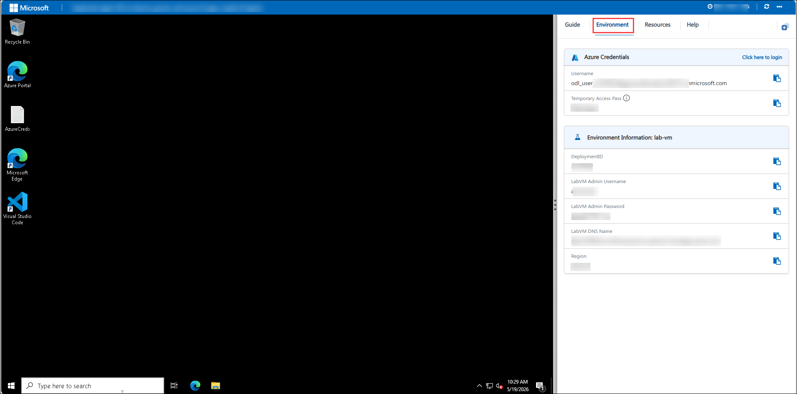
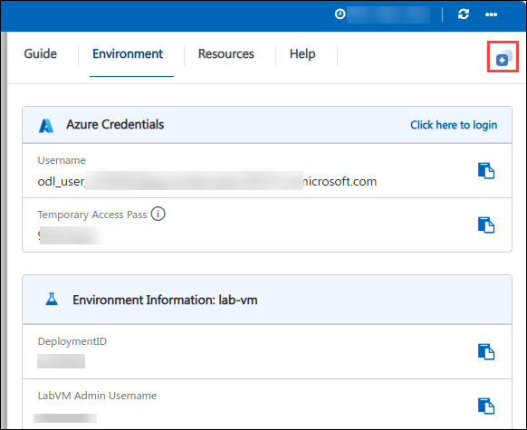
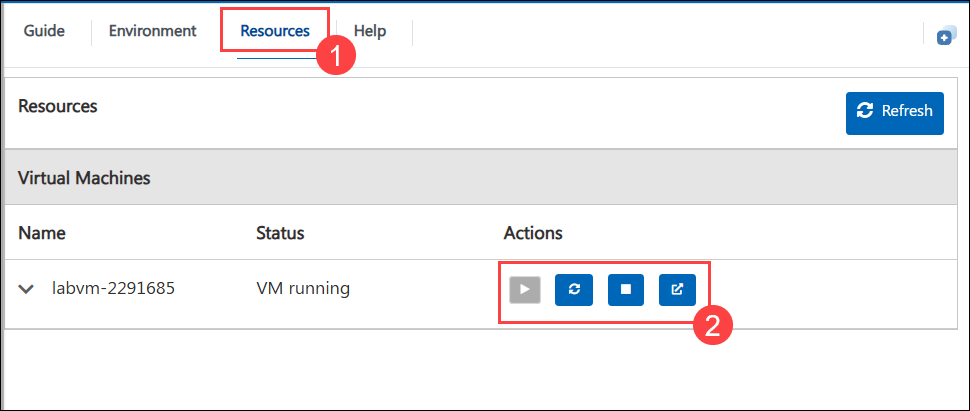
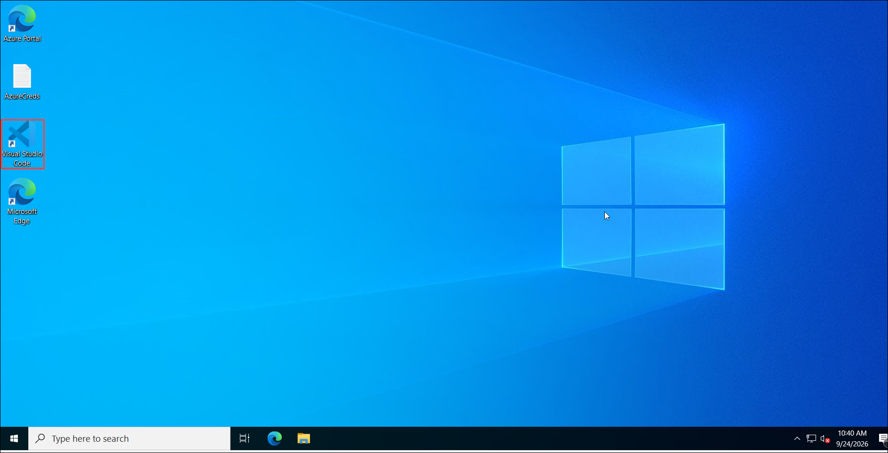
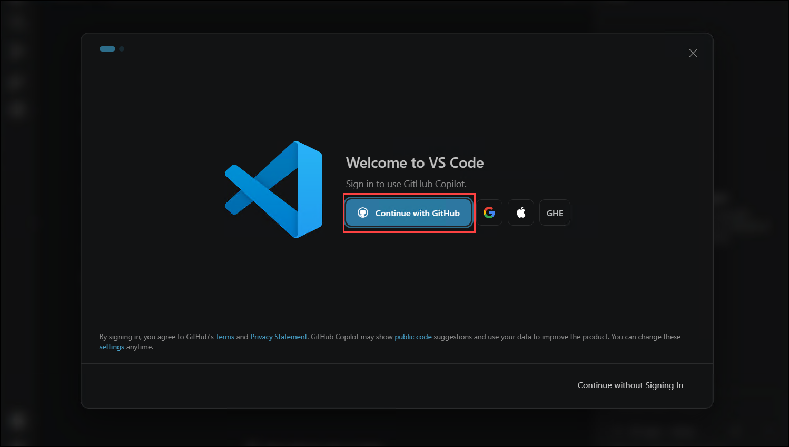
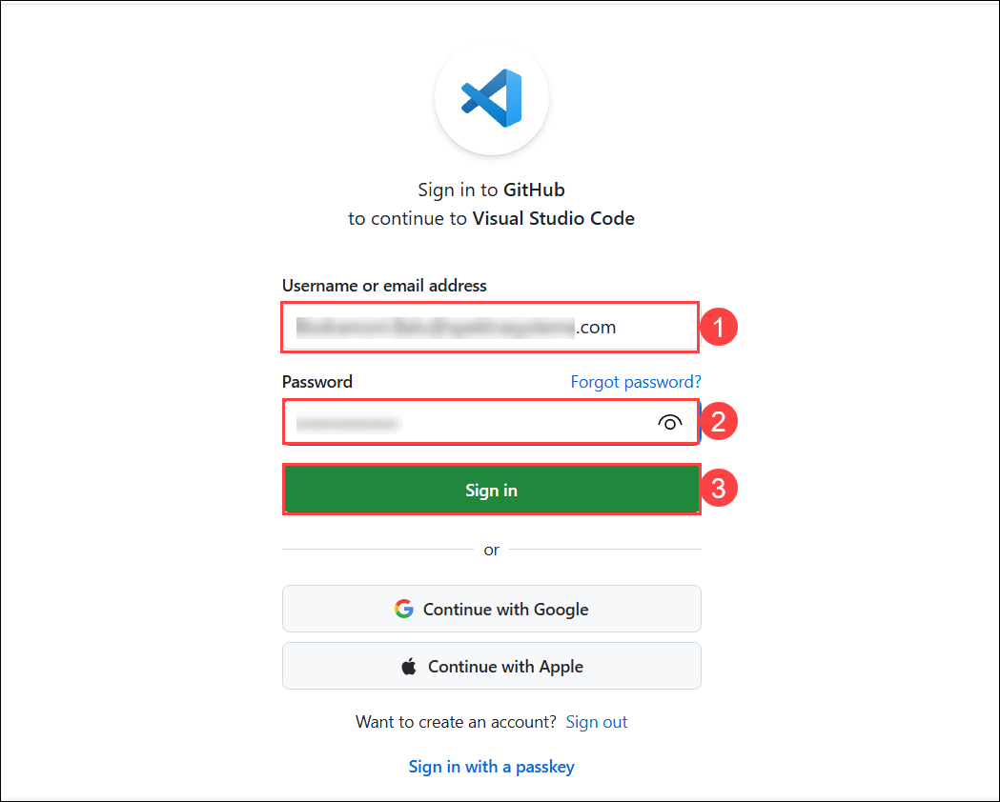
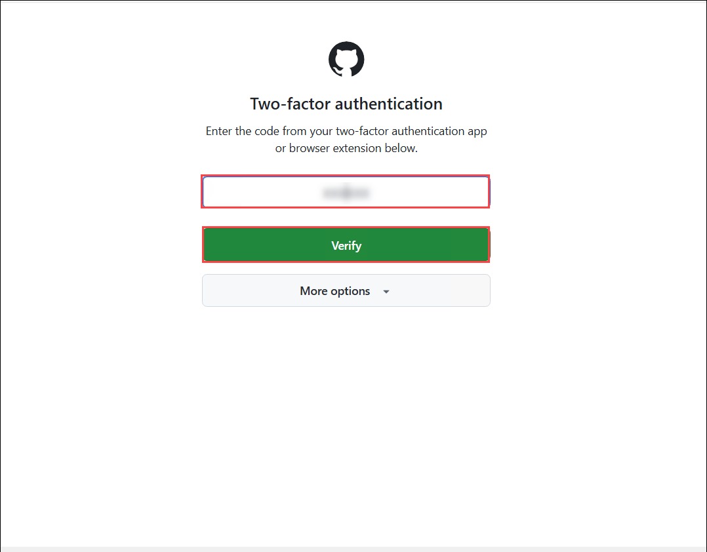
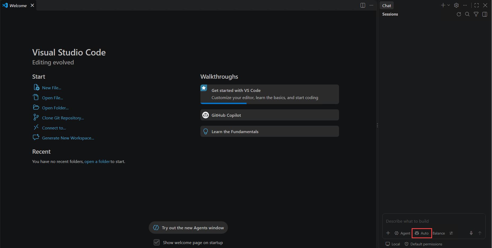

# Accelerate Delivery with Hypervelocity Engineering (HVE)

### Estimated Duration: 2 Hours

## 📘 Lab Scenario

You are a software engineer at **Contoso Data Services**, a company that runs data pipelines for enterprise customers. Your team has adopted GitHub Copilot, but the results have been uneven. Copilot is excellent at small, well-scoped edits and unreliable on anything that touches more than one file. Engineers report the same pattern repeatedly: the AI produces code that looks correct, compiles, and quietly ignores the conventions the codebase already established. Nobody can say afterwards what the AI assumed, what it decided, or how the result was verified.

Your engineering leadership has asked you to evaluate **Hypervelocity Engineering (HVE)**, Microsoft's AI-native engineering practice, and specifically the **RPI lifecycle** it is built around: **Research → Plan → Implement → Review**, followed by routed follow-up.

Your assigned backlog item is a real one. The Contoso ingestion pipeline currently writes processed output to local disk only. Customers have asked for output to land in **Azure Blob Storage**. You will use RPI end to end to deliver that change, and in doing so you will see why giving each kind of work a clear contract and a durable artifact produces a materially different result from prompting Copilot directly.

## 📖 Lab Overview

In this hands-on lab, you will learn how to apply **Hypervelocity Engineering** using **HVE Core**, Microsoft's open-source agent and prompt library for GitHub Copilot. You will begin by understanding what HVE is, how it differs from ordinary AI-assisted coding, and how the RPI entry surfaces and their durable artifacts work. You will then install and validate HVE Core in Visual Studio Code and run a complete RPI cycle against a real Python codebase.

You will produce five durable artifacts along the way: a research document backed by evidence, an implementation plan with stable phase and task identifiers, an independent plan critique, a change log, and a review record. By the end of the session, you will have delivered a working Azure Blob Storage writer and will understand the discipline that made it reliable.

## 🎯 Objectives

By the end of this lab, you will be able to:

- **Introduction to HVE and Environment Setup**: In this hands-on exercise, you will gain insights about what Hypervelocity Engineering is, why the RPI lifecycle exists, and why Research runs only when an evidence gap exists. You will install the HVE Core extension in Visual Studio Code, validate that the RPI Agent and `/rpi-*` prompts are available in GitHub Copilot Chat, prepare the sample repository, and complete your first interaction with an RPI surface.

- **Research Phase: Build Verified Knowledge**: In this hands-on exercise, you will gain insights about the Research phase of RPI. You will confirm that a real evidence gap exists, run `/rpi-research` against the Contoso pipeline codebase, observe how it gathers evidence read-only instead of generating code, inspect the research artifact it produces, and refine its findings with a follow-up question.

- **Plan Phase: Turn Research into a Contract**: In this hands-on exercise, you will gain insights about the Plan phase. You will run `/rpi-plan` against your research, inspect the plan and the independent critique it produces, understand how `Pxx` phases and `Pxx-Txx` tasks are structured, and apply a human review to the plan before any code is written.

- **Implement and Review Phases**: In this hands-on exercise, you will gain insights about the Implement and Review phases. You will execute the plan task by task, inspect the change log, run the test suite, run the read-only acceptance review with `/rpi-review`, use `/rpi-challenger` to expose unverified assumptions, and route the resulting follow-up.

## ⚙️ Prerequisites

- Working knowledge of Visual Studio Code and basic Git operations.
- Ability to read a code diff and interpret a test run.
- Prior exposure to GitHub Copilot Chat. This lab is not an introduction to Copilot.
- Basic familiarity with Python. Deep expertise is not required, the lab does not ask you to write code by hand.
- An active GitHub account with a **GitHub Copilot** entitlement and Copilot Chat enabled.
- No prior knowledge of HVE or RPI is required. That is what this lab teaches.

## 🏗️ Architecture

This lab runs entirely on a developer workstation. There is no Azure control plane to provision. The lab virtual machine hosts Visual Studio Code, the GitHub Copilot and HVE Core extensions, Python 3.11, Git, and a pre-cloned sample repository. GitHub Copilot Chat connects outbound to the GitHub Copilot service, where the RPI entry surfaces activate their skills over the model. All workflow artifacts are written to the local `.copilot-tracking/` folder inside the sample repository, in dated subfolders, which is where you will inspect the output of each phase.

## 🖼️ Architecture Diagram

  

## 🔍 Explanation of Components

1. **Hypervelocity Engineering (HVE)**: HVE is Microsoft's AI-native engineering practice. It is not a software framework and there is nothing to import or code against. It is a process discipline plus a structural specification for packaging AI guidance so that it is repeatable across a team rather than living in individual engineers' prompting habits.

1. **The RPI Lifecycle**: RPI stands for Research, Plan, Implement, Review. The full pipeline is `Task context & evidence` ➔ `Research (only when a gap exists)` ➔ `Plan` ➔ `Implement` ➔ `Review` ➔ `Follow-up`. Each phase has a behavioural contract and writes a durable artifact, so state lives in files rather than in chat history. Research is conditional: if the available evidence is already adequate, Research is satisfied and skipped, or an existing document is reused, and the reason is logged.

1. **HVE Core**: HVE Core is the open-source implementation of HVE, published by Microsoft at `github.com/microsoft/hve-core` and distributed as a Visual Studio Code extension. It ships the RPI entry surfaces, skills, and supporting assets that plug into GitHub Copilot Chat.

1. **The RPI entry surfaces**: You start work through one of these. The **RPI Agent** is a user-selected lifecycle wrapper that activates the applicable RPI skills under one task identity. It is manual by default, with "Full Auto" available on request, and it is an entry surface rather than an autonomous swarm of task workers. The prompts are `/rpi-research` (read-only), `/rpi-plan`, `/rpi-implement`, and `/rpi-review` (read-only). Two specialised surfaces support the lifecycle: `/rpi-challenger` exposes assumptions through adaptive skeptical questions, and `/rpi-walkthrough` explains code or artifacts one segment at a time.

1. **The `.copilot-tracking/` folder**: This is where RPI writes its artifacts. Research documents, plans, plan critiques, change logs and review records all land here in dated subfolders named with the task slug. These files are the handoff mechanism between phases. RPI deliberately passes documents rather than chat history, which is what allows you to reset context between phases without losing anything.

1. **Review outcomes and follow-up**: The review record separates **Execution Status** (`Complete`, `Partial`, `Blocked`) from **Outcome** (`Conformant`, `Conformant with justified divergence`, `Defects found`, `Residual work`, `Not accepted`). Findings carry severity-graded `RV-xxx` identifiers and are routed: defects to implementation, decision gaps to planning, evidence gaps to research, and residual work to distinct backlog items.

## 📁 Repository Structure

The sample repository used in this lab is a Python data pipeline. Your work will be confined to the `src/pipeline/` and `tests/` trees.

```
contoso-pipeline/
├── src/
│   └── pipeline/
│       ├── __init__.py
│       ├── runner.py                  # Pipeline orchestration entry point
│       ├── models.py                  # Record and batch data models
│       ├── config.py                  # Configuration loading
│       ├── readers/
│       │   ├── __init__.py
│       │   └── csv_reader.py          # Source data reader
│       └── writers/                   # Your lab focus
│           ├── __init__.py
│           ├── base.py                # WriterBase abstract class
│           └── local_writer.py        # LocalFileWriter (existing implementation)
│
├── tests/
│   ├── test_runner.py
│   ├── test_models.py
│   └── writers/
│       ├── test_base.py
│       └── test_local_writer.py
│
├── data/
│   └── sample_records.csv             # Sample input data
│
├── docs/
│   ├── architecture.md                # Pipeline design notes
│   └── conventions.md                 # Team coding conventions
│
├── .copilot-tracking/                 # RPI artifacts land here (git-ignored)
├── requirements.txt
├── pytest.ini
└── README.md
```

## 🚀 Getting Started with the Lab

Welcome to your Hypervelocity Engineering Workshop! We've prepared a seamless environment for you to explore and learn. Let's begin by making the most of this experience:

## Accessing Your Lab Environment

Once you are ready to dive in, your virtual machine and **Guide** will be right at your fingertips within your web browser.

   

## Lab Guide Zoom In/Zoom Out

To adjust the zoom level for the environment page, click the **A↕: 100%** icon located next to the timer in the lab environment.

   

## Virtual Machine & Lab Guide

Your virtual machine is your workhorse throughout the workshop. The lab guide is your roadmap to success.

## Exploring Your Lab Resources

To get a better understanding of your lab resources and credentials, navigate to the **Environment** tab.

   

## Utilizing the Split Window Feature

For convenience, you can open the lab guide in a separate window by selecting the **Split Window** button from the top right corner.

 

## Managing Your Virtual Machine

Feel free to **start, stop, or restart (2)** your virtual machine as needed from the **Resources (1)** tab. Your experience is in your hands!

 

## Validating Your Lab Tasks

Once you complete a task, you will see a **Validate** button integrated within the lab guide. Click this button to ensure the lab instructions have been followed correctly and the tasks have been completed successfully.

- Click **Validate** to run the validation check for the current task.

  

- If the validation is successful, a **Success** status will be displayed, and you can proceed to the next task.

  

- If the validation fails, you will see a **"See why?"** option. Select this to view details about what went wrong.

- After addressing the issue, click **Retry Validation** to re-run the check.

  

If you continue to face issues, carefully review the steps in the lab guide before attempting validation again.

## ⚠️ A Note on AI Output

The RPI surfaces in this lab are powered by a large language model. Their output varies between runs. Your research document, plan and code will not match the screenshots word for word, and that is expected. The validations in this lab check that the **right artifacts exist and have the right shape**, not that they contain exact text. If your output differs in wording but follows the same structure, you are on track.

## 💻 Let's Get Started with the Lab Environment

1. On your virtual machine, locate the **Visual Studio Code** icon on the desktop and double-click to open it.

   

1. When Visual Studio Code opens, you will be prompted to sign in to GitHub to activate Copilot. Click **Sign in** in the notification, or select the **Accounts** icon in the lower left corner and choose **Sign in with GitHub**.

   

1. A browser window will open. Enter your GitHub credentials:

   - **GitHub Username:** <inject key="GitHubUserName"></inject>

   - **GitHub Password:** <inject key="GitHubPassword"></inject>

     

1. Complete any multi-factor authentication prompt if one appears, then click **Authorize Visual Studio Code** when asked.

   

1. Return to Visual Studio Code. Confirm that the **Copilot** icon in the title bar no longer shows a warning badge. This means Copilot is active on your account.

   

   >**Note:** If Copilot reports that no subscription is available, contact CloudLabs support before continuing. Every exercise in this lab depends on an active Copilot entitlement.

## 🆘 Support Contact

The CloudLabs support team is available 24/7, 365 days a year, via email and live chat to ensure seamless assistance anytime. We offer dedicated support channels tailored specifically for learners and instructors, ensuring that all your needs are promptly and efficiently addressed.

Learner Support Contacts:

- Email Support: cloudlabs-support@spektrasystems.com
- Live Chat Support: https://cloudlabs.ai/labs-support

Click **Next** from the lower right corner to move on to the next page.


## Happy Learning!!
