# Exercise 04: Implement and Review Phases

### Estimated Duration: 40 Minutes

## 📘 Scenario

You have an approved plan. The Contoso backlog item is now fully specified: which files to create, which patterns to follow, which line references to work from, and how each step will be judged complete.

In this exercise you will execute that plan and then validate the result. The Task Implementor agent works phase by phase rather than generating everything at once, and it can pause after each phase, which gives you control points along the way. The Task Reviewer agent then checks the finished work against the written specification rather than against the conversation. Finally, you will read the follow-up work the workflow surfaced and decide where each item belongs.

## 📖 Overview

In this exercise, you will complete the RPI cycle. You will execute the first phase of the plan and check it, let the implementor finish the rest, inspect the change log, run the test suite, and run the review. You will close by routing the follow-up items to the right phase.

By the end of this exercise, you will have a working Azure Blob Storage writer, a passing test suite, a change log, and a review log, all produced through a controlled workflow rather than a single large prompt.

## 🎯 Objectives

In this exercise, you will complete the following tasks:

- Task 1: Execute the first plan phase
- Task 2: Execute the remaining plan phases
- Task 3: Inspect the change log and run the tests
- Task 4: Run the Review phase
- Task 5: Route follow-up work

### Task 1: Execute the First Plan Phase

In this task, you will run the Implement phase with a pause after every phase, so you can see the granularity the workflow operates at.

1. Confirm you are in a **fresh Copilot Chat conversation**. If not, click the **+** icon at the top of the panel.

      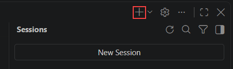

1. Look at the **agent picker** at the bottom left of the chat box. If it still shows **Task Planner** from the last exercise, click it and select **Task Implementor**.


    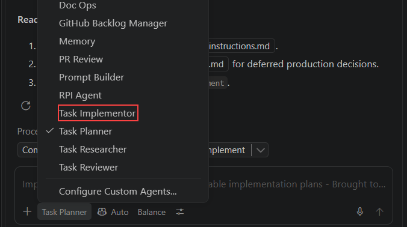

    >**Note:** The picker keeps the last agent you used. Running `/task-implement` normally switches it for you, but checking first avoids the work landing with the wrong agent.

1. In the Explorer, right-click your plan file under `.copilot-tracking/plans/` (the file ending in `-plan.instructions.md`) and select **Copy Relative Path**.

    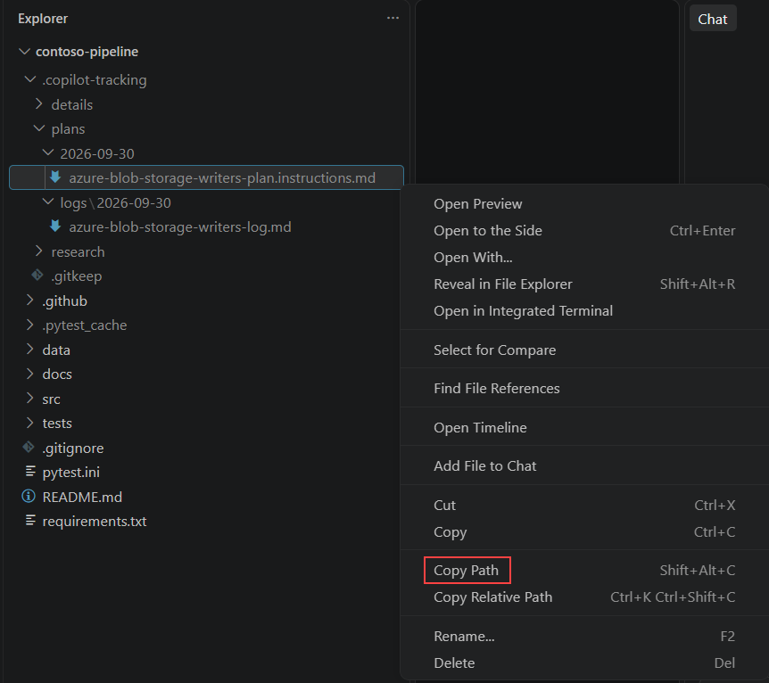

1. In the chat input box, type the following, pasting your plan path in place of the placeholder. Press **Shift+Enter** after each line, then press **Enter** to send:

    ```
    /task-implement plan=.copilot-tracking/plans/YYYY-MM-DD/<task>-plan.instructions.md phaseStop=true

    Treat every item in the plan's Success Criteria section as binding, including the requirement for tests that cover the partial-write failure path.
    ```

    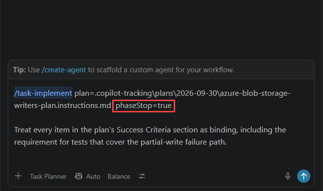

    >**Note:** `phaseStop=true` makes the implementor pause after each phase so you can review it. Confirm that the agent picker now shows **Task Implementor**.

1. Watch the implementor work. It reads the plan and the details file, creates the change log, and carries out **Phase 1** only. Then it stops and summarises what it did.

    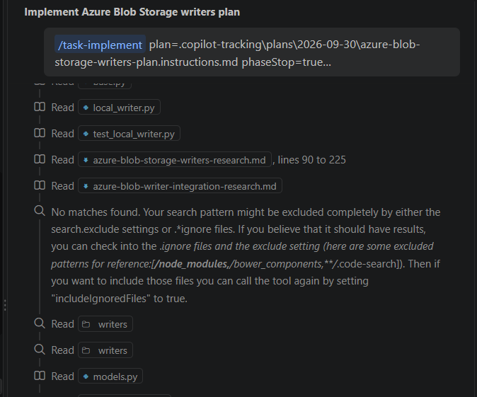

    >**Note:** Notice that it is not designing anything. Every decision was made in the Plan phase. This is constrained execution, and it is why the output follows your existing patterns instead of introducing new ones.

1. While the implementor works, answer any prompt that appears in the same way each time:

    | If you see | Do this |
    |---|---|
    | A box asking **Run pwsh command?** | Click **Allow** |
    | A multiple-choice question | Choose the option the agent marks or recommends, usually the first, then click **Submit** |
    | A bar at the bottom of the chat saying **N files changed**, with **Keep** and **Undo** | Click **Keep** |

    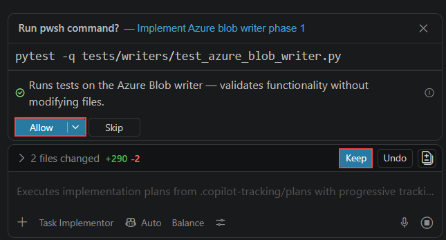

    >**Note:** The commands are the ones the implementor needs, such as reading files and running `pytest`. **Keep** accepts the files the implementor wrote. **Undo** would throw them away, so do not click it.
1. Confirm that the implementor stops after Phase 1 and presents a summary of completed changes before proceeding.    

     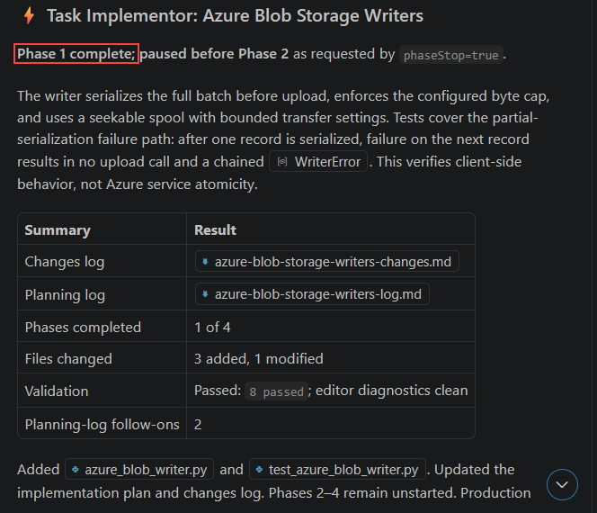


1. Open the Source Control view (**Ctrl+Shift+G**). Confirm that one or more files are listed as new or changed. Click one to see the diff.

    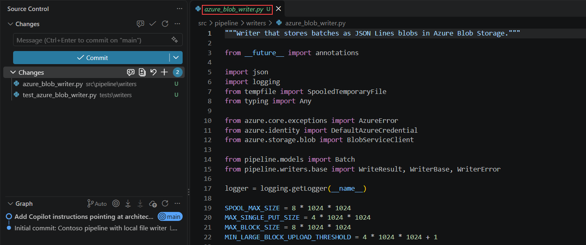

1. Open the plan file, press **Ctrl+F**, and search for `[x]`. Confirm you get matches. These are the steps of Phase 1 that the implementor ticked.

    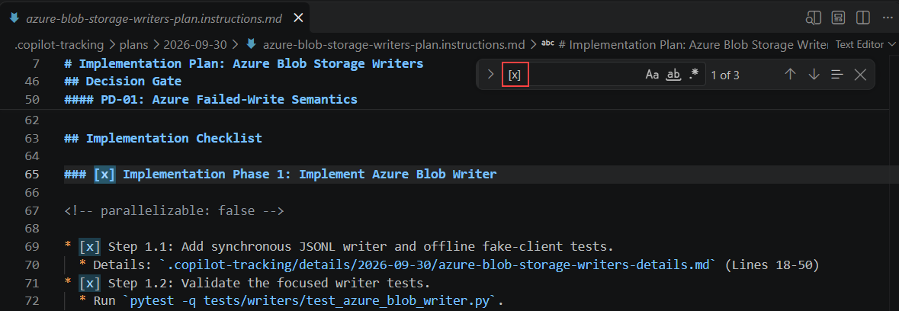

    >**Note:** The implementor ticks a step only after it has done it, and it records the work in the change log. A tick is your evidence that the step was done.

   > **Congratulations** on completing the task! Now, it's time to validate it. Here are the steps:
   - Hit the validate button for the corresponding task. If you receive a success message, you can proceed to the next task.
   - If not, carefully read the error message and retry the step, following the instructions in the exercise guide.
   - If you need any assistance, don't hesitate to get in touch with us at cloudlabs-support@spektrasystems.com. We are available 24/7 to assist you.

   <validation step="00000000-0000-0000-0000-000000000008" />

### Task 2: Execute the Remaining Plan Phases

In this task, you will let the implementor finish the rest of the plan.

1. Stay in the **same chat**. Paste this and press **Enter**:

    ```
    Continue with all remaining phases without stopping.
    ```

    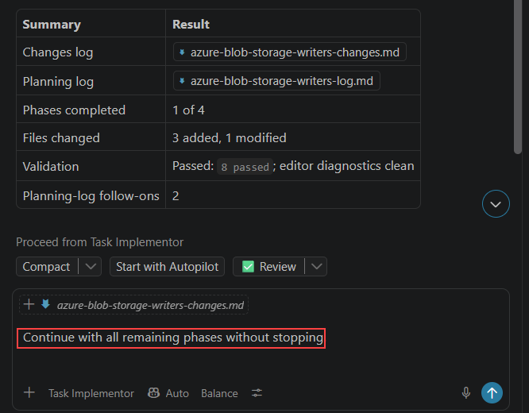

1. Watch the implementor work through the remaining phases. Answer each prompt the same way as in Task 1: **Allow** for commands, the recommended option for questions, and **Keep** for the changed-files bar.

    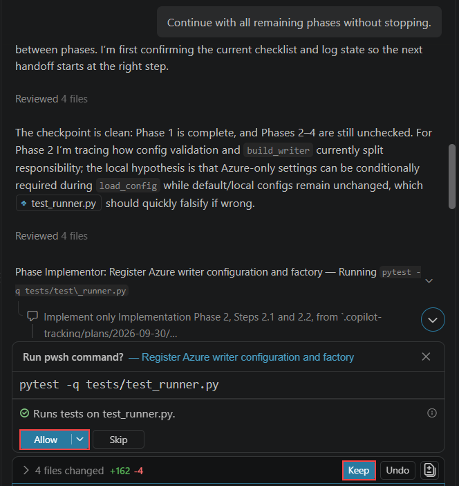

    >**Note:** This step takes the longest in the lab, typically eight to twelve minutes. Use the time to keep the plan file open beside the chat, and watch the steps get ticked one by one.


1. Wait until the implementor reports that all phases are complete.

    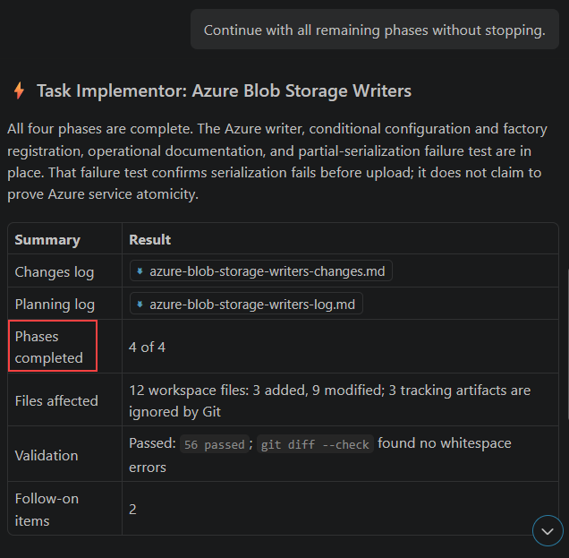

1. Open the plan file, press **Ctrl+F**, and search for `[ ]`. You should get **no matches**. Every step is now ticked.

    
    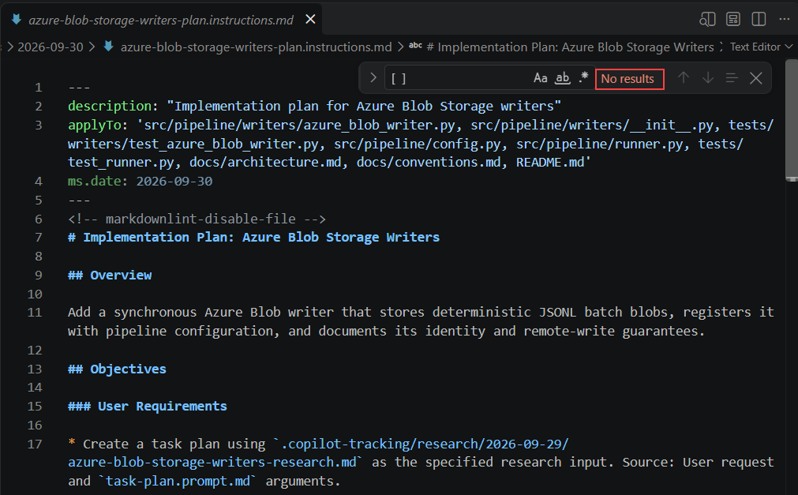

    >**Note:** If you still find `[ ]`, send this in the same chat, then search again: `Continue with the steps that are not yet ticked in the plan.`

   > **Congratulations** on completing the task! Now, it's time to validate it. Here are the steps:
   - Hit the validate button for the corresponding task. If you receive a success message, you can proceed to the next task.
   - If not, carefully read the error message and retry the step, following the instructions in the exercise guide.
   - If you need any assistance, don't hesitate to get in touch with us at cloudlabs-support@spektrasystems.com. We are available 24/7 to assist you.

   <validation step="00000000-0000-0000-0000-000000000009" />

### Task 3: Inspect the Change Log and Run the Tests

In this task, you will read what the implementor recorded and confirm the code actually works.

1. Open the change log file:

    ```
    .copilot-tracking/changes/YYYY-MM-DD/<task>-changes.md
    ```

    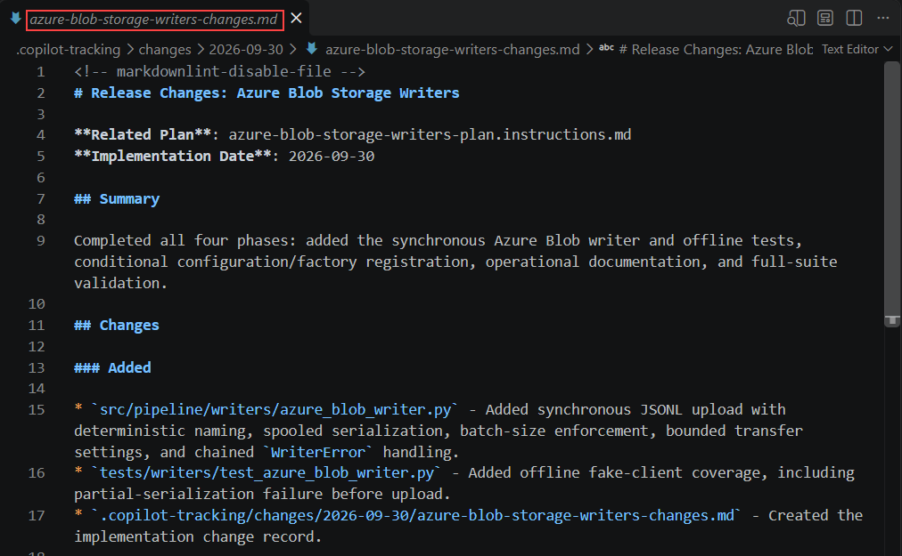

1. Press **Ctrl+F** and search for each of these. Each one should be found:

    - `### Added`
    - `### Modified`
    - `## Release Summary`

    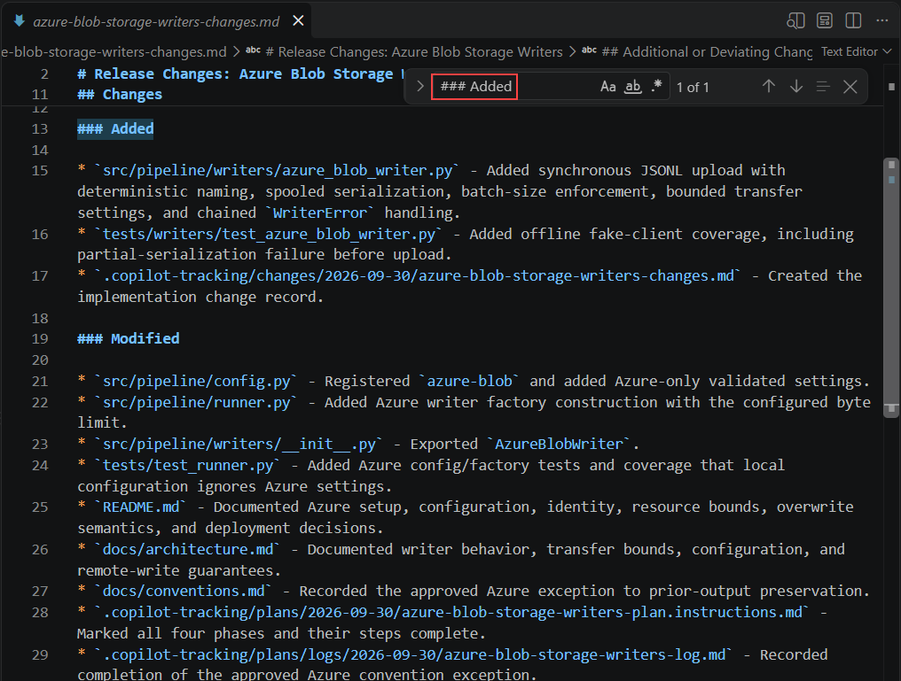
    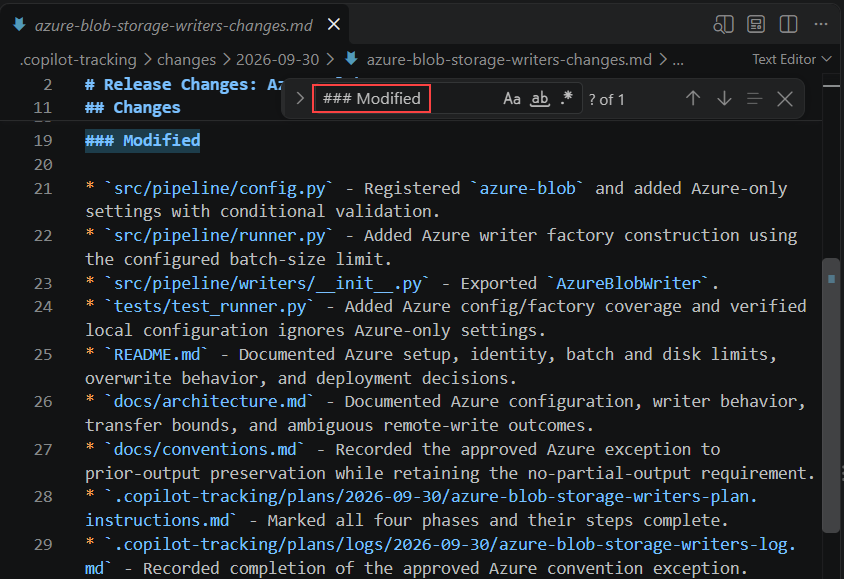
    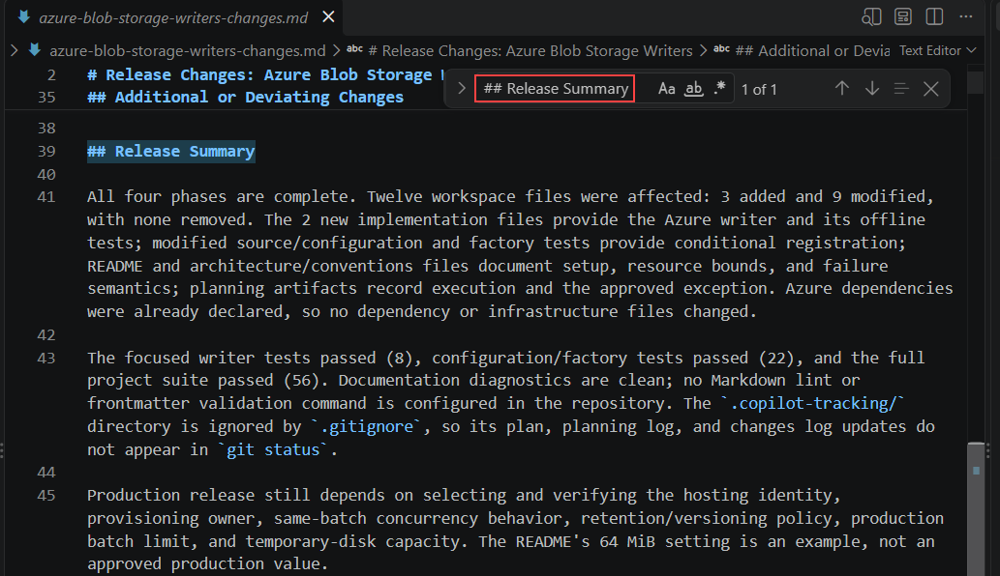

    >**Note:** The change log lists every file added and modified, with a short statement of what changed in each. It is the artifact that makes a pull request reviewable, and it is one of the inputs the Review phase uses. The implementor also offers a commit message when it finishes. Do not commit anything yet.

1. Open the integrated terminal at the repository root (**Ctrl+`**) and run:

    ```
    pytest -q
    ```

    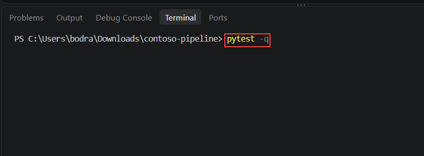

1. Confirm the last line says all tests passed, with no failures.

    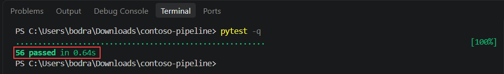

    >**Note:** If any test fails, do not fix it by hand. Send the failure to the implementor in the same chat and let it correct the work against the plan. Hand-patching breaks the audit trail that the change log and review log depend on.

1. Run this command to look for the partial-write test:

    ```
    pytest -v | Select-String -Pattern "partial"
    ```

    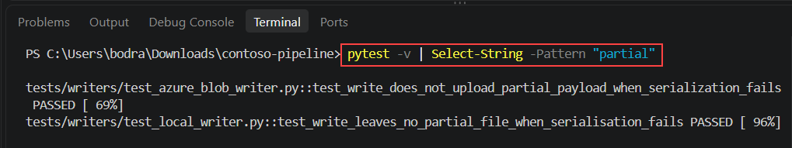

    You should see at least one test name. This is the requirement **you** added by hand in Exercise 03, and finding it here shows a human edit to the plan reaching the delivered code.

    >**Note:** If no line appears, send this in the implementor chat, then run `pytest -q` again: `The plan's success criteria require tests for the partial-write failure path. Add them, update the change log, then run pytest -q.` Do not write the test yourself. This is a defect being routed back to implementation.

   > **Congratulations** on completing the task! Now, it's time to validate it. Here are the steps:
   - Hit the validate button for the corresponding task. If you receive a success message, you can proceed to the next task.
   - If not, carefully read the error message and retry the step, following the instructions in the exercise guide.
   - If you need any assistance, don't hesitate to get in touch with us at cloudlabs-support@spektrasystems.com. We are available 24/7 to assist you.

   <validation step="00000000-0000-0000-0000-000000000010" />

### Task 4: Run the Review Phase

In this task, you will run the Review phase.

1. Start a **fresh Copilot Chat conversation** by clicking the **+** icon, or by typing **/clear**.

    

    >**Note:** This reset matters more than any of the others. A reviewer that can still see the implementor's reasoning tends to accept it. A reviewer starting cold has to check the work against the written record, which is the entire point.

1. Look at the **agent picker**. If it still shows **Task Implementor**, click it and select **Task Reviewer**.

     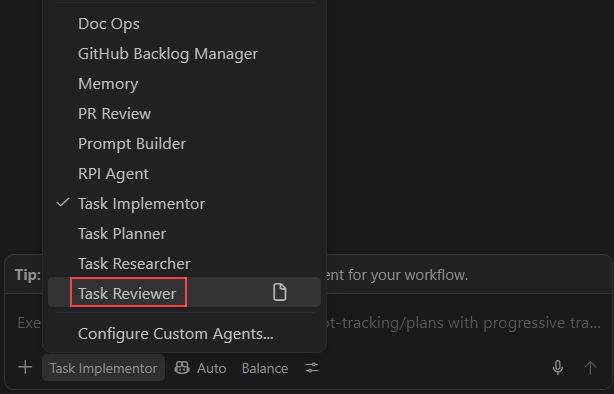

1. Type the following, pasting your plan path in place of the placeholder, and press **Enter**:

    ```
    /task-review plan=.copilot-tracking/plans/YYYY-MM-DD/<task>-plan.instructions.md
    ```

    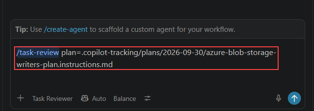

    >**Note:** Confirm that the agent picker now shows **Task Reviewer**. The reviewer finds the matching research, details and change log from the plan.

1. Wait for the reviewer to finish. Click **Allow** on any **Run pwsh command?** box, as in Task 1. It checks each plan phase against the code, checks quality and conventions, and runs the tests. Its final message includes a summary table with the **Review Log** path, the **Overall Status**, and counts of critical, major and minor findings.

    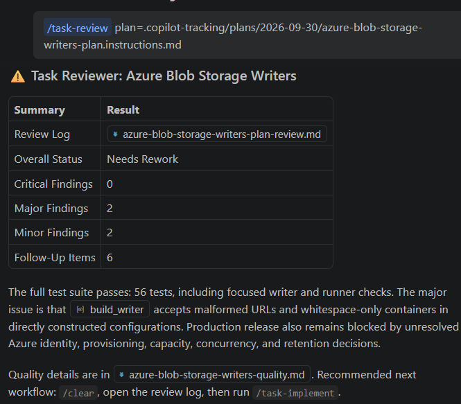

1. Open the review log. It is saved with the plan name, ending in `-review.md`:

    ```
    .copilot-tracking/reviews/YYYY-MM-DD/<task>-plan-review.md
    ```

    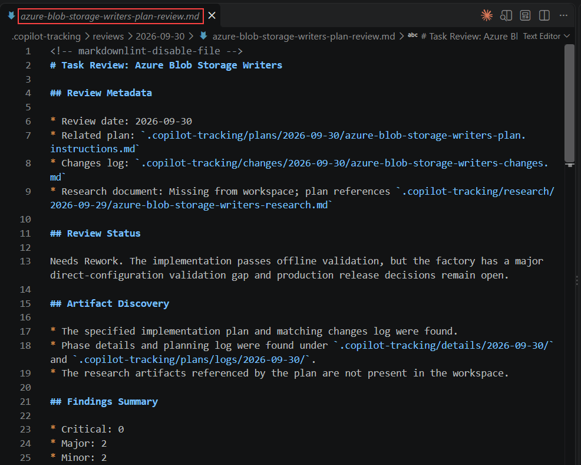

1. Press **Ctrl+F** and search for `status`, `critical`, `major` and `minor`. Each should be found.

    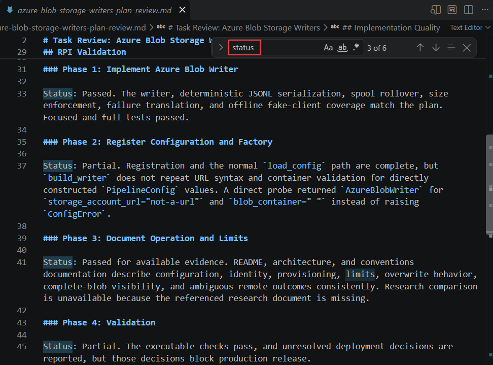

    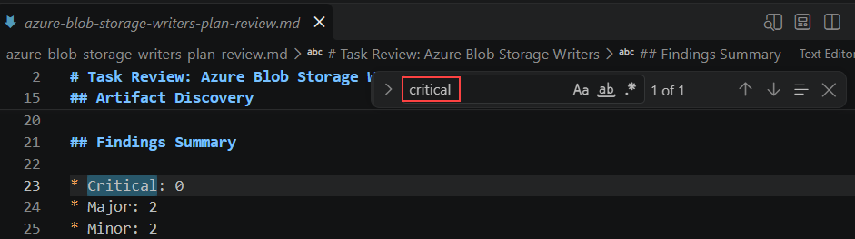

   

    >**Note:** The review log records the severity counts, the result for each plan phase, the test command results, and the follow-up work. The overall status is one of **Complete**, **Needs Rework** or **Blocked**.

    >**Note:** Your findings will differ from other learners'. A typical minor finding is a missing docstring on a new method. What matters is that the review exists, that it graded its findings, and that it gave an overall status.

1. Look at the overall status.

    | If the status is | What to do |
    |---|---|
    | **Complete** | Continue to Task 5. |
    | **Needs Rework** | Do the rework steps below, then come back to this table. |
    | **Blocked** | Read what blocks the review, resolve it, then run `/task-review` again. |

    >**Note:** **Needs Rework** means the review found at least one **critical** or **major** finding. Minor findings alone do not cause it. It is a normal result. The workflow is designed to send the work back and check it again.

1. **Only if the status is Needs Rework:** find the findings that caused it. Press **Ctrl+F** in the review log and search for `critical`, then `major`. Read each one and decide which kind it is:

    | Kind of finding | How to recognise it | What to do |
    |---|---|---|
    | **Code finding** | It names a file, a function or a failing test. | Use the **code fix** prompt in the next step. |
    | **Decision finding** | It names no file. It says a choice is missing, such as identity, provisioning, limits, concurrency or retention. | Use the **decision fix** prompt in the next step. |

    

    >**Note:** A decision finding can't be fixed by changing code. If you send it to the implementor as a code fix, the next review returns **Needs Rework** again. Fix it by writing the decision down in the plan and the docs.

1. **Only if the status is Needs Rework:** start a fresh chat, select **Task Implementor** in the agent picker, and send the prompt that matches your findings. Paste your review log path.

    For **code findings**:

    ```
    /task-implement Fix every critical and major finding in .copilot-tracking/reviews/YYYY-MM-DD/<task>-plan-review.md. Update the change log, then run pytest -q.
    ```

    For **decision findings**:

    ```
    /task-implement Resolve every critical and major decision finding in .copilot-tracking/reviews/YYYY-MM-DD/<task>-plan-review.md. For each open decision, record an explicit choice and its reason in the plan, the README and the conventions docs. Do not change code unless a decision requires it. Update the change log, then run pytest -q.
    ```

    If the review has both kinds, send the code fix prompt first, then the decision fix prompt.

    

    >**Note:** Naming the review log in the message makes sure the implementor reads it. Answer any **Run pwsh command?** box with **Allow**, and click **Keep** on the changed-files bar, as in Task 1.

1. When the implementor finishes, run `pytest -q` in the terminal and confirm every test passes. For decision findings, also open the plan and the README and confirm the decisions are written there.

1. **Move the old review files out of the way.** In the Explorer, create a folder called `review-archive` inside `.copilot-tracking`. Drag these two items into it:

    - `.copilot-tracking/reviews/YYYY-MM-DD/<task>-plan-review.md`
    - the folder `.copilot-tracking/reviews/rpi`

    

    >**Note:** This step is the one that makes the second review different from the first. When the reviewer starts, it looks for an existing review log and completed validation files, and it resumes from them and keeps the results it already has. If you leave the old files in place, it repeats its earlier verdict without checking the new code. Moving them forces a fresh review, and you still keep the old log as evidence.

1. **Review again.** Start a fresh chat, select **Task Reviewer**, and run the same command as before:

    ```
    /task-review plan=.copilot-tracking/plans/YYYY-MM-DD/<task>-plan.instructions.md
    ```

    Open the new review log and check the overall status again.

    >**Note:** The number of critical and major findings should be lower, and the status should now be **Complete**. If the same finding appears again, the implementor did not fix it. For a code finding, open the finding and check that the named file changed. For a decision finding, check that the decision is written in the plan and the docs. Then repeat the steps above once more, this time adding the finding text to your message. Minor findings alone do not block you.

   > **Congratulations** on completing the task! Now, it's time to validate it. Here are the steps:
   - Hit the validate button for the corresponding task. If you receive a success message, you can proceed to the next task.
   - If not, carefully read the error message and retry the step, following the instructions in the exercise guide.
   - If you need any assistance, don't hesitate to get in touch with us at cloudlabs-support@spektrasystems.com. We are available 24/7 to assist you.

   <validation step="00000000-0000-0000-0000-000000000011" />

### Task 5: Route Follow-up Work

In this task, you will read the follow-up work the workflow found and decide which phase each item belongs to.

1. In the review log, press **Ctrl+F** and search for `follow-up`. Read the items listed. They are split into work **deferred from scope** and work **discovered during review**.

    

1. Open the planning log:

    ```
    .copilot-tracking/plans/logs/YYYY-MM-DD/<task>-log.md
    ```

    Press **Ctrl+F** and search for `Follow-On`. Read the suggested follow-on work.

    

    >**Note:** Typical items are retry behaviour, credential handling, large-file streaming and concurrent writes to the same blob. Not every item is worth acting on. Its value is that the next steps are written down while the context is fresh.

1. For each item, use this table to decide where it goes:

    | What the item is | Where it goes | Prompt |
    |---|---|---|
    | The delivered code is wrong, or a success criterion was missed | Implement | `/task-implement` |
    | Scope the plan left out | Plan | `/task-plan` |
    | Missing technical knowledge | Research | `/task-research` |
    | Valid work outside this change | A separate backlog item | A new RPI cycle |

    

    >**Note:** The Task Reviewer's own handoff uses the same routes: clear the chat with `/clear`, open the review log, then start `/task-implement`, `/task-research` or `/task-plan`. Routing each finding to the right phase keeps it from being lost in a comment thread.

1. Open each of the six files you produced across this lab, one at a time:

    ```
    .copilot-tracking/research/YYYY-MM-DD/<topic>-research.md
    .copilot-tracking/plans/YYYY-MM-DD/<task>-plan.instructions.md
    .copilot-tracking/details/YYYY-MM-DD/<task>-details.md
    .copilot-tracking/plans/logs/YYYY-MM-DD/<task>-log.md
    .copilot-tracking/changes/YYYY-MM-DD/<task>-changes.md
    .copilot-tracking/reviews/YYYY-MM-DD/<task>-plan-review.md
    ```

    

    >**Note:** Read as a set, these files tell the complete story of a change: what was known, what was decided, what was done, and what was verified. That trail is what makes AI-assisted work auditable, and it is the strongest argument for adopting HVE on a team rather than leaving prompting to individual habit.

<question source="Questions/question-06.md" />

## 🧾 Summary

In this exercise, you have successfully:

- Executed the first plan phase with `/task-implement`, using an explicit plan path and a phase stop.
- Checked the result in Source Control and in the ticked plan steps.
- Executed the remaining phases and confirmed every plan step was ticked.
- Inspected the change log and confirmed the test suite passes, including the criterion you added by hand.
- Ran the Review phase with `/task-review` and read the review log covering severity counts, test results, follow-up items and overall status.
- Routed follow-up work to implementation, planning, research, or the backlog.
- Reviewed the six RPI artifacts as a single audit trail.

## 🏁 Lab Conclusion

In this lab, you learned what Hypervelocity Engineering is and applied the RPI workflow end to end to deliver a real change to a real codebase.

The takeaway is not that the AI wrote a blob storage writer. Plain Copilot would also have written something. The takeaway is *how* it was written: grounded in evidence you can trace, sequenced by a plan you approved and amended, executed under constraints you controlled, and validated against a written specification rather than a chat transcript. The artifacts in `.copilot-tracking/` are the durable record of that process.

To take this further with your own team, review the HVE Core documentation at **https://microsoft.github.io/hve-core/**, and in particular the Team Adoption Guide.

>**Note:** HVE Core is described by Microsoft as highly opinionated and rapidly evolving. This lab was written against version 3.2.2, and later versions have already begun to change the prompts and artifacts. Treat HVE Core as a source of patterns to adapt rather than a stable production dependency, and pin a version when you standardise on it.

### You have successfully completed the lab.

