# Exercise 03: Plan Phase - Turn Research into a Contract

### Estimated Duration: 25 Minutes

## 📘 Scenario

You now have a research document describing exactly how the Contoso pipeline's writer package works and how an Azure Blob Storage writer should fit into it. What you do not have is a sequence of work. Knowledge is not a plan.

In this exercise you will run the Plan phase. The Task Planner agent reads your research and produces a phased, checkable plan with success criteria. Once you approve it, that plan becomes a contract, and the Implement phase follows it.

## 📖 Overview

In this exercise, you will execute the second phase of the RPI workflow. You will invoke the Task Planner agent with `/task-plan`, point it at your research document, and inspect the three files it produces: a plan, a details file and a planning log. You will then apply your own human review and amend the plan before approving it.

By the end of this exercise, you will have an approved implementation plan organised into phases and steps, ready for execution.

## 🎯 Objectives

In this exercise, you will complete the following tasks:

- Task 1: Run the Plan phase
- Task 2: Inspect the plan and details files
- Task 3: Read the planning log
- Task 4: Apply your own human review and approve the plan

### Task 1: Run the Plan Phase

In this task, you will invoke the Task Planner agent using the `/task-plan` prompt.

1. Confirm you are in a **fresh Copilot Chat conversation**. If not, click the **+** icon at the top of the Copilot Chat panel.

    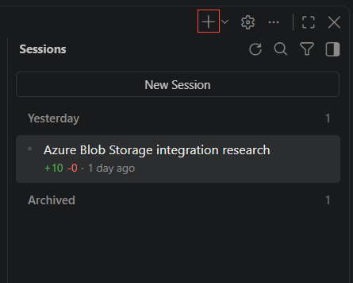

1. In the Explorer, right-click your research file under `.copilot-tracking/research/` (the file ending in `-research.md`) and select **Copy Relative Path**.

    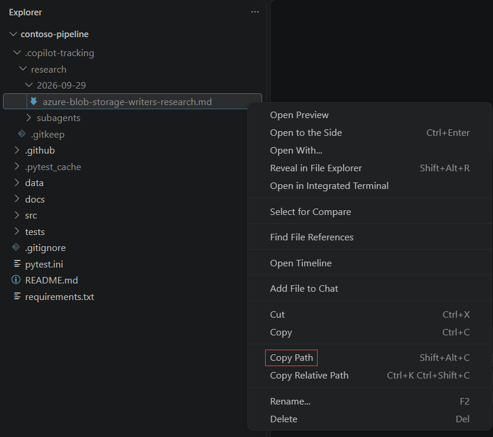

1. In the chat input box, type the following, pasting your research path in place of the placeholder, and press **Enter**:

    ```
    /task-plan research=.copilot-tracking/research/YYYY-MM-DD/<topic>-research.md
    ```

    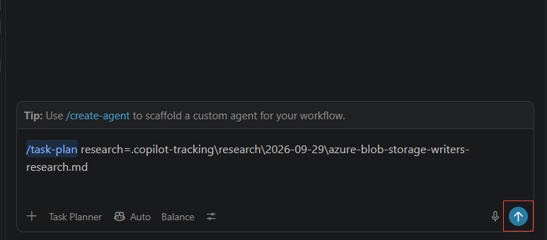

    >**Note:** The `research=` input tells the planner exactly which document to build on. Confirm that the agent picker now shows **Task Planner**. The planner writes only under `.copilot-tracking/`. It never edits your source code.

1. Watch the planner work. It reads the research, builds the plan and the details file, keeps a planning log, and then checks its own plan against the research.

    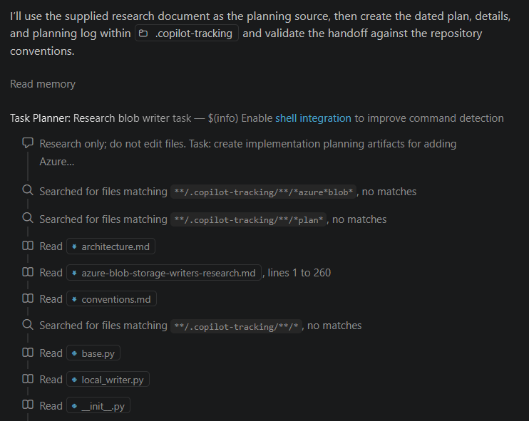

1. While the planner works, a box may appear that asks **Run pwsh command?** with a `git diff` line. Click **Allow**, and if a **1 file changed** bar appears at the bottom of the chat, click **Keep**.

    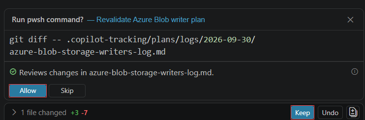

1. If the planner asks **Before implementation, which Azure Blob writer contract should the plan adopt?**, choose **A: Approve narrow Azure exception**, then click **Submit**.

    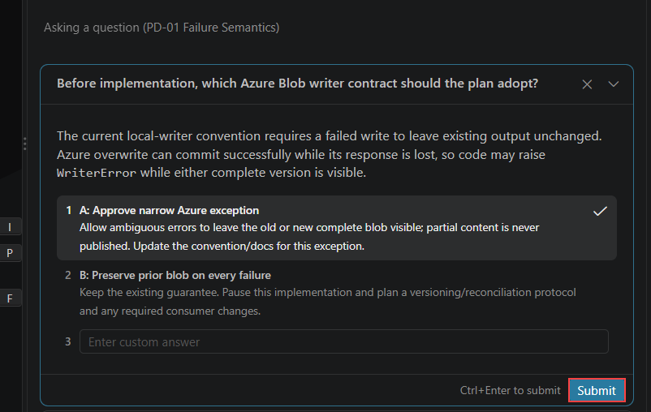

1. Wait until the planner reports the plan files it has written.

    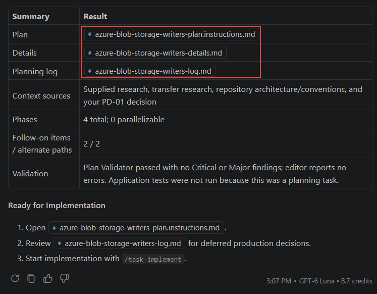

   > **Congratulations** on completing the task! Now, it's time to validate it. Here are the steps:
   - Hit the validate button for the corresponding task. If you receive a success message, you can proceed to the next task.
   - If not, carefully read the error message and retry the step, following the instructions in the exercise guide.
   - If you need any assistance, don't hesitate to get in touch with us at cloudlabs-support@spektrasystems.com. We are available 24/7 to assist you.

   <validation step="00000000-0000-0000-0000-000000000006" />

### Task 2: Inspect the Plan and Details Files

In this task, you will open the plan and the details file. The plan says *what* to do. The details file says *precisely where and how*.

1. In the Explorer, expand **.copilot-tracking (1)**, then **plans (2)**, then **today's date (3)**. Open the plan file:

    ```
    .copilot-tracking/plans/YYYY-MM-DD/<task>-plan.instructions.md
    ```

    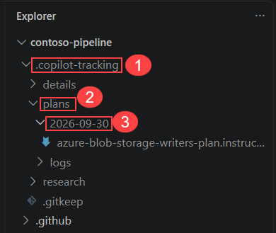

    >**Note:** The name before `-plan.instructions.md` comes from your task, so it may differ from the screenshots. The `.instructions.md` ending is how HVE Core names plan files.

1. Press **Ctrl+F** and search for each of these. Each one should be found:

    - `## Implementation Checklist`
    - `Implementation Phase 1`
    - `parallelizable`
    - `Details:`
    - `## Success Criteria`

    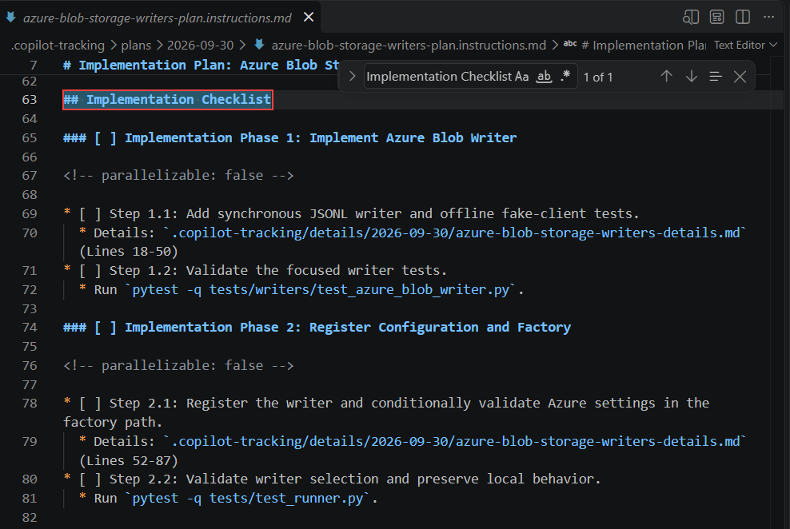

    >**Note:** The number of phases and steps varies from run to run. A typical plan has three phases plus a final validation phase. Phase 1 creates the Blob Storage client wrapper, Phase 2 creates the writer, Phase 3 wires it into the configuration and adds tests, and the last phase runs the full test suite. Dependencies come first, integration last.

1. Search for `[ ]`. You should get matches, and a search for `[x]` should get **none**.

    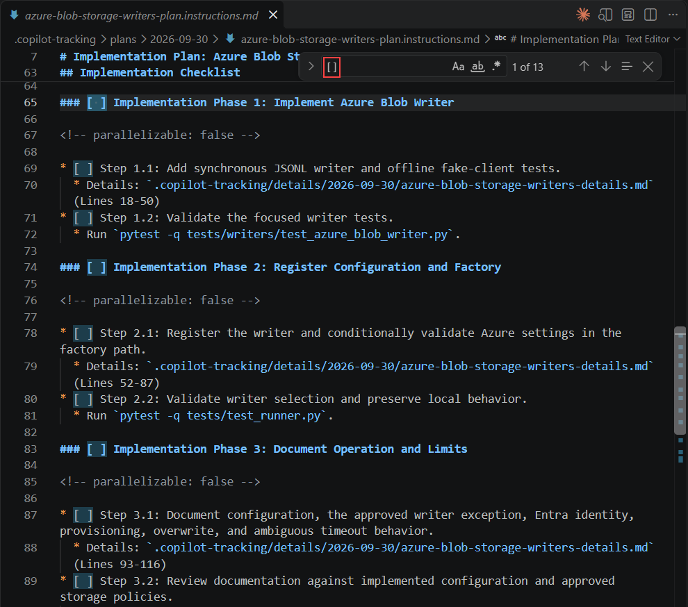

    >**Note:** Every step is unticked because nothing has been implemented yet. The implementor ticks a step only after it has done the work.

1. Open the details file:

    ```
    .copilot-tracking/details/YYYY-MM-DD/<task>-details.md
    ```

    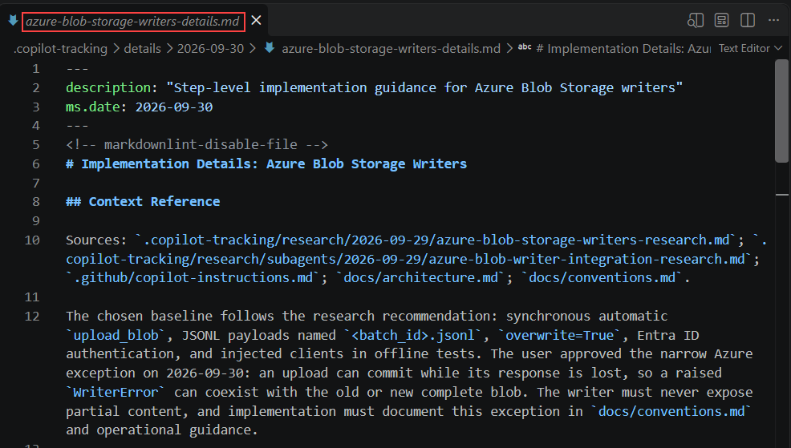

1. Press **Ctrl+F** and search for `### Step 1.1`. Read the step.

    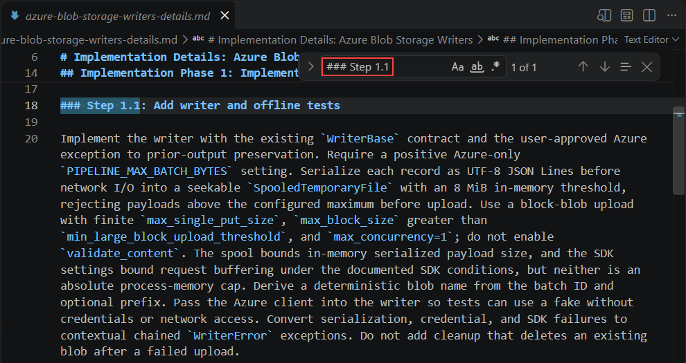

    >**Note:** Each step in the details file lists the file operations to perform and line references into your codebase. Each plan step points to a range of lines here, which is why the implementor does not have to decide anything.

1. Open the Source Control view (**Ctrl+Shift+G**). Confirm nothing under `src/`, `tests/` or `docs/` is listed as changed.

    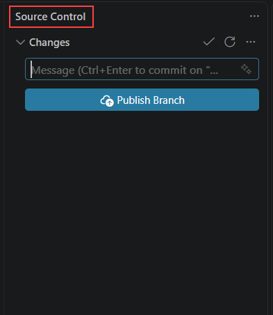

    >**Note:** Planning wrote only to `.copilot-tracking/`, which is git-ignored, so nothing appears at all.

   > **Congratulations** on completing the task! Now, it's time to validate it. Here are the steps:
   - Hit the validate button for the corresponding task. If you receive a success message, you can proceed to the next task.
   - If not, carefully read the error message and retry the step, following the instructions in the exercise guide.
   - If you need any assistance, don't hesitate to get in touch with us at cloudlabs-support@spektrasystems.com. We are available 24/7 to assist you.

   <validation step="00000000-0000-0000-0000-000000000007" />

### Task 3: Read the Planning Log

In this task, you will read the third file, in which the planner records how it made its decisions.

1. Go back to the plan file, press **Ctrl+F**, and search for `## Planning Log`. The line below it shows the path of the log.

    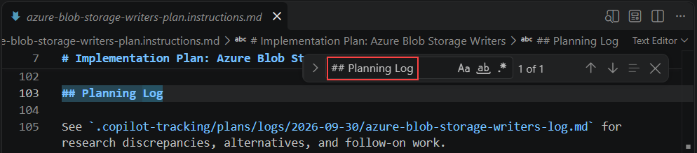

1. Open the planning log:

    ```
    .copilot-tracking/plans/logs/YYYY-MM-DD/<task>-log.md
    ```

    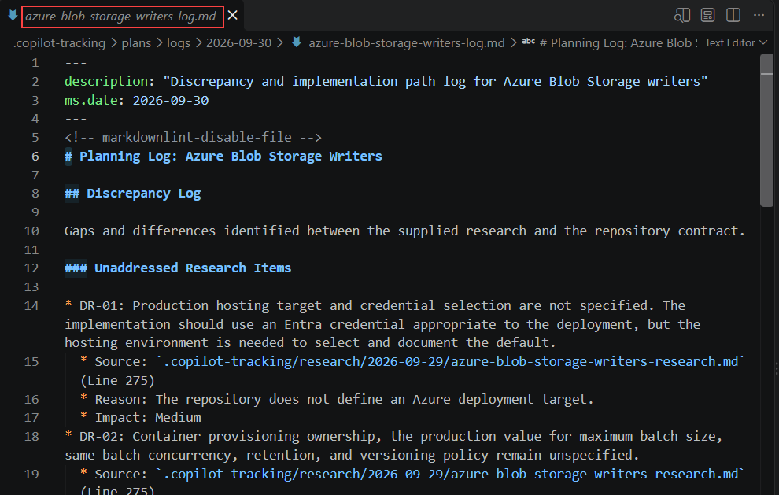

1. Press **Ctrl+F** and search for each of these. Each one should be found:

    - `Discrepancy Log`
    - `Implementation Paths`
    - `Follow-On`

    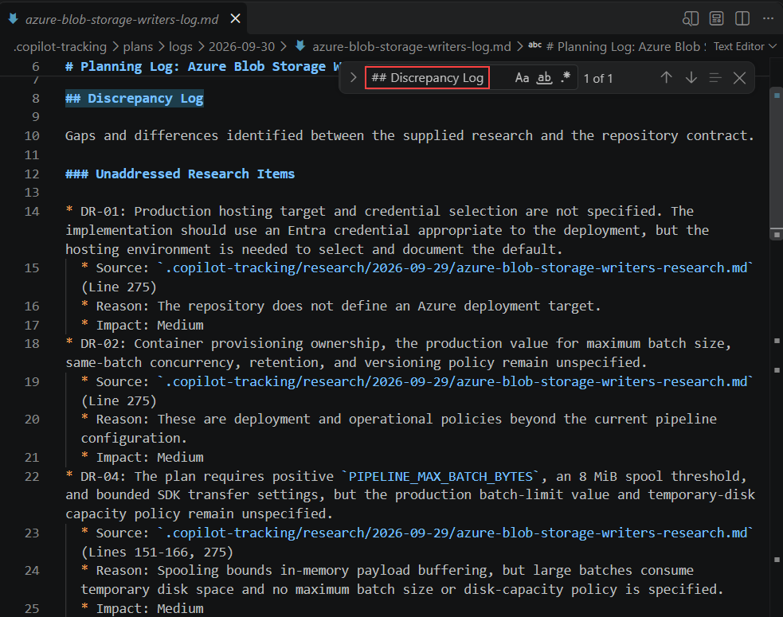

    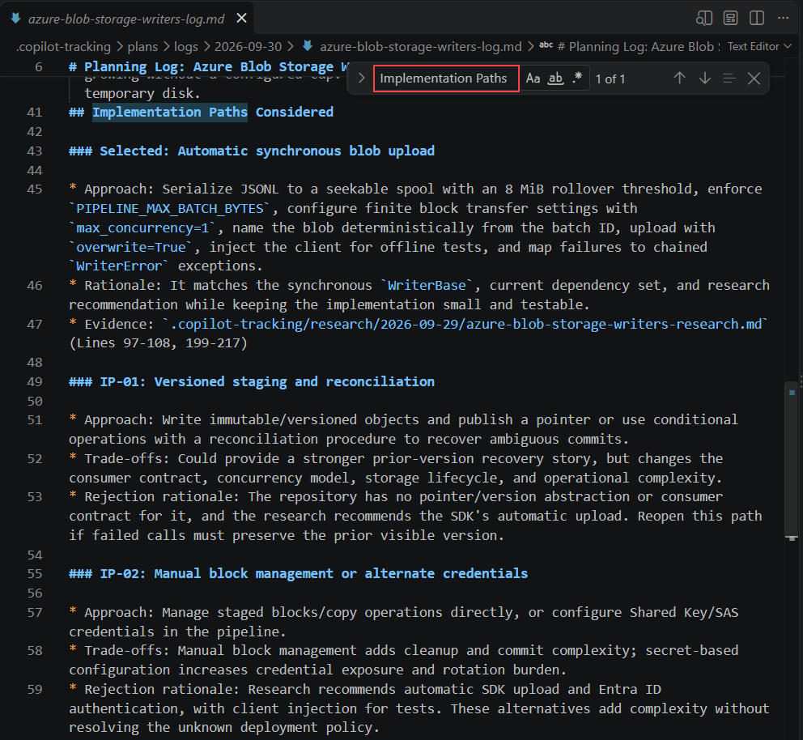

    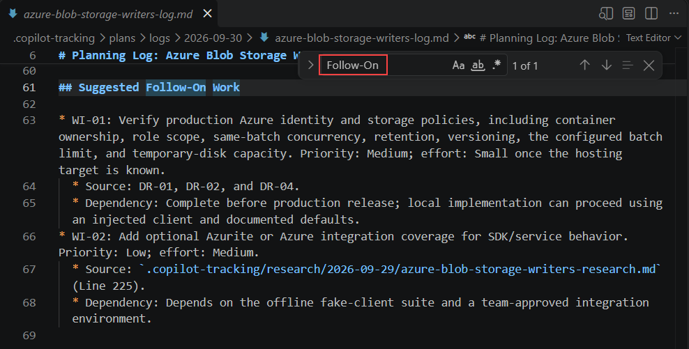


    >**Note:** The **Discrepancy Log** lists places where the plan and the research do not fully match. **Implementation Paths Considered** lists the options the planner weighed and why it chose one. **Suggested Follow-On Work** lists ideas left out on purpose. The planner already checked its plan against the research and fixed anything serious, so what remains is the honest list of caveats. A short log with few items is fine.

    >**Note:** This is a cheap check at the cheapest possible moment. Catching a missing requirement here costs one edit to a markdown file. Catching the same thing after implementation costs a rework cycle across several source files.

### Task 4: Apply Your Own Human Review and Approve the Plan

In this task, you will add your own requirement to the plan. This is the human-in-the-loop control point of the whole workflow.

1. Return to the plan file, `<task>-plan.instructions.md`.

1. Press **Ctrl+End** to jump to the very end of the file. The last section is **Success Criteria**.

    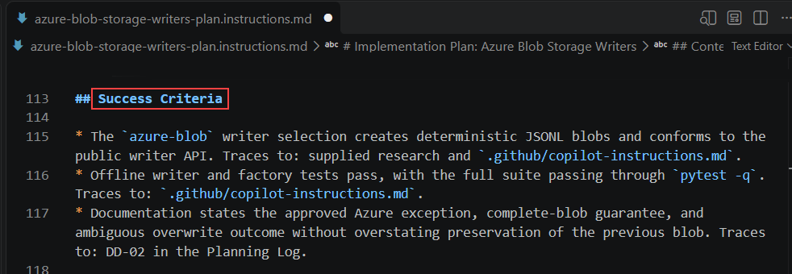

1. If the last line is not empty, press **Enter** to start a new line. Paste this line, then press **Ctrl+S** to save:

    ```
    * Tests must cover the partial-write failure path, matching LocalFileWriter behaviour. — Traces to: user requirement added during plan review
    ```

    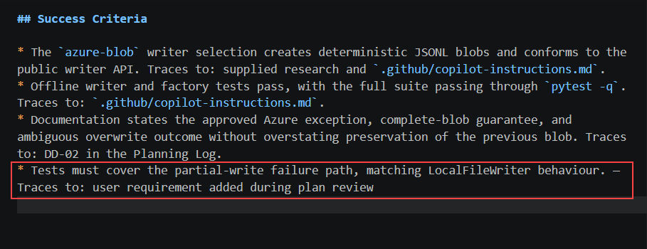

    >**Note:** You are editing the plan by hand, in the editor, not by asking an agent to change it. The plan is a document you own. This is the moment where your judgement enters the workflow, and it is the reason RPI produces a plan file at all rather than going straight from research to code.

1. Press **Ctrl+F** and search for `partial-write`. Confirm your line is found, and that the tab shows no unsaved-changes dot.

    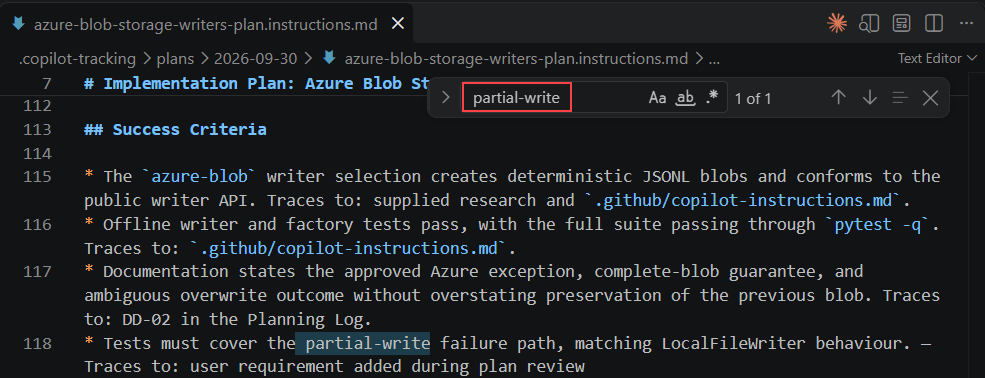

    >**Note:** Edit the plan, not the details file. The plan refers to line numbers inside the details file, so adding lines to the details file would make those references point at the wrong place.

    >**Note:** If the plan has no **Success Criteria** heading, add `## Success Criteria` on a new line at the very end of the file, then add the bullet under it.

1. Start a fresh chat by clicking the **+** icon at the top of the Copilot Chat panel, or by typing **/clear**.

    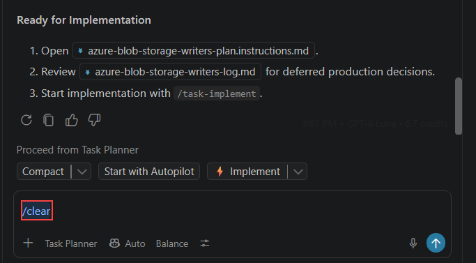

    >**Note:** The approved plan is on disk. The Implement phase will read it from there. Clearing context now also discards any half-formed ideas the planner explored, which is precisely what you want the implementor not to inherit.

<question source="Questions/question-05.md" />

## 🧾 Summary

In this exercise, you have successfully:

- Invoked the Task Planner agent using the `/task-plan` prompt and pointed it at your research document.
- Confirmed that planning wrote only to `.copilot-tracking/` and left your source code untouched.
- Inspected the plan's numbered phases, parallelization markers and success criteria.
- Inspected the details file and its step-by-step instructions.
- Read the planning log covering discrepancies, alternatives considered and follow-on work.
- Added your own success criterion to the plan by hand.
- Cleared the chat context in preparation for the Implement phase.

### You have successfully completed the exercise. Click **Next >>** to continue to the next exercise.

