# Exercise 02: Research Phase - Build Verified Knowledge

### Estimated Duration: 25 Minutes

## 📘 Scenario

Your backlog item is to add Azure Blob Storage output to the Contoso ingestion pipeline. An engineer under time pressure would open Copilot Chat and ask it to write a blob writer. That is exactly the failure mode HVE exists to prevent, because the AI does not yet know what `WriterBase` requires, how the existing `LocalFileWriter` handles errors, what the team's conventions document says, or which Azure SDK the project already depends on.

In this exercise you will run the Research phase instead. The Task Researcher agent will investigate all of that and write down what it found, with evidence. No source code will be written.

## 📖 Overview

In this exercise, you will execute the first phase of the RPI workflow. You will invoke the Task Researcher agent against a real backlog item, observe it gathering evidence from the codebase and external documentation, and inspect the research document it produces. You will then refine the research with a follow-up question and read the recommended approach it settled on.

By the end of this exercise, you will have a research document that the Plan phase can consume, and you will understand why a phase that produces no code is worth twenty minutes of a two-hour delivery.

## 🎯 Objectives

In this exercise, you will complete the following tasks:

- Task 1: Run the Research phase
- Task 2: Inspect the research document
- Task 3: Read the evidence and the recommended approach
- Task 4: Refine the research with a follow-up

### Task 1: Run the Research Phase

In this task, you will invoke the Task Researcher agent using the `/task-research` prompt.

1. Confirm you are working in the **contoso-pipeline** folder in Visual Studio Code.

1. Open **GitHub Copilot Chat** with **Ctrl+Alt+I**.

1. If the chat panel shows any earlier conversation, start a fresh one by clicking the **+** icon at the top of the panel.

    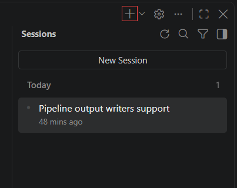

    >**Note:** Every RPI phase begins in a clean context. This is not optional.

1. In the chat input box, type the following prompt and press **Shift+Enter** after each line so it stays a single message, then press **Enter** to send it:

    ```
    /task-research Azure Blob Storage integration for the Contoso pipeline writers package

    Add Azure Blob Storage output to the Contoso pipeline. The pipeline currently writes to local disk through LocalFileWriter in src/pipeline/writers/.

    Research:
    - How WriterBase and LocalFileWriter work, and what a new writer must implement
    - The team conventions in docs/conventions.md
    - Which Azure SDK the project already depends on, and how to upload a blob with it
    - Authentication options and error handling for failed uploads

    Focus on approaches that match the existing patterns in the codebase. Do not write any code.
    ```

    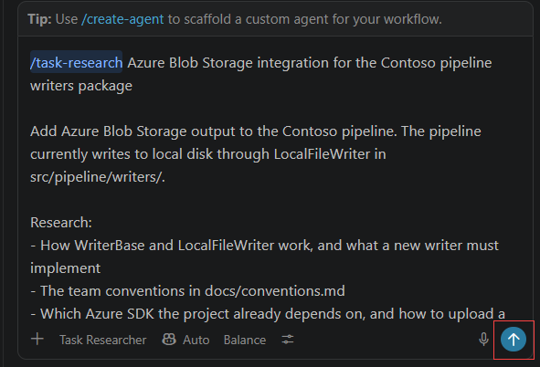

    >**Note:** The `/task-research` prompt automatically routes to the **Task Researcher** agent. You do not need to select the agent yourself. This is the Prompt to Agent delegation flow. Confirm that the agent picker at the bottom of the chat input now shows **Task Researcher**.

1. Watch the agent work. You will see it read files from the repository, follow references between them, and consult external documentation. This can take several minutes.

    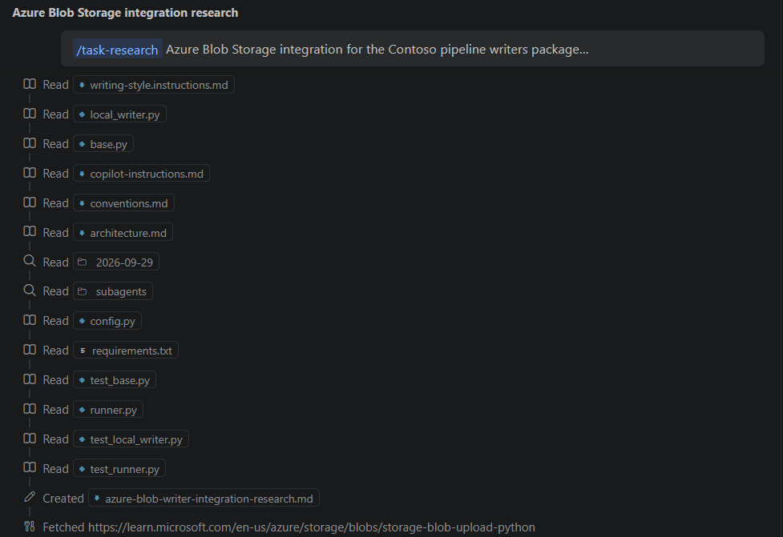

    >**Note:** Notice what it is doing and what it is not doing. It is reading `base.py`, `local_writer.py`, `requirements.txt` and `docs/conventions.md`. It is only writing files under `.copilot-tracking/research/`, and it is not creating or editing any file in `src/`. If you see it propose or write code in `src/`, it has drifted from its role, and you should tell it to continue researching rather than implementing.

1. If the agent asks a clarifying question, answer it briefly and let it continue.

1. Wait until the agent reports that the research document has been written. It will state the file path in its final message.

    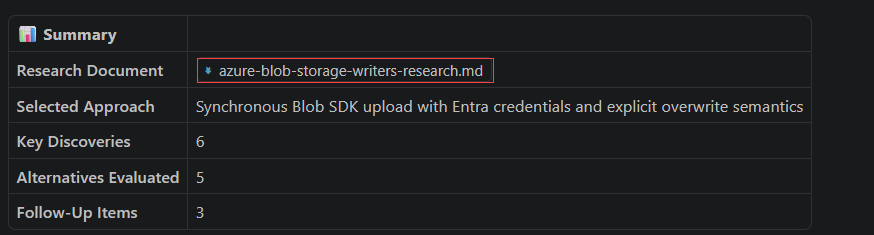

   > **Congratulations** on completing the task! Now, it's time to validate it. Here are the steps:
   - Hit the validate button for the corresponding task. If you receive a success message, you can proceed to the next task.
   - If not, carefully read the error message and retry the step, following the instructions in the exercise guide.
   - If you need any assistance, don't hesitate to get in touch with us at cloudlabs-support@spektrasystems.com. We are available 24/7 to assist you.

   <validation step="00000000-0000-0000-0000-000000000004" />

### Task 2: Inspect the Research Document

In this task, you will locate and open the research document the agent produced. The document, not the chat transcript, is the real output of this phase.

1. In the Visual Studio Code Explorer pane, expand the **.copilot-tracking (1)** folder, then **research (2)**, then the folder named with **today's date (3)**.

    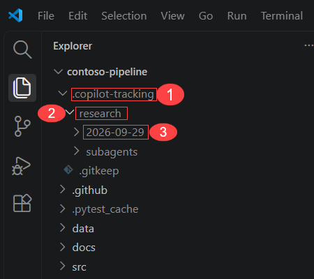

    >**Note:** If `.copilot-tracking` is not visible, it is being hidden as an ignored folder. Open the Explorer's overflow menu (the **...** at the top of the pane) and ensure hidden files are shown, or open the file directly with **Ctrl+P** and type `research`.

1. Open the research file. It will be named following the pattern below:

    ```
    .copilot-tracking/research/YYYY-MM-DD/<topic>-research.md
    ```

    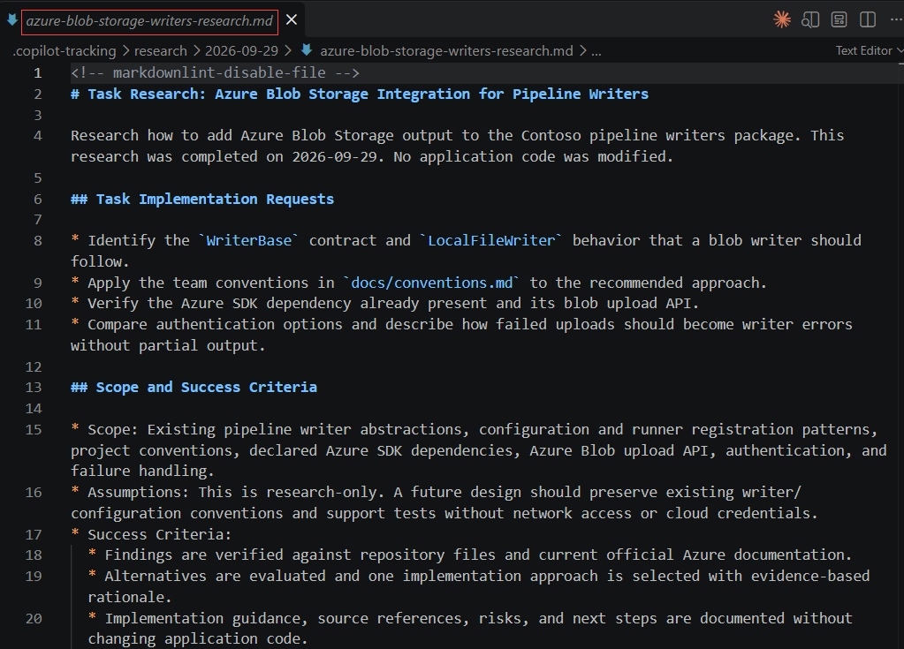

    >**Note:** The exact topic name depends on how the agent interpreted your prompt. It may be `blob-storage-research.md`, `azure-blob-storage-research.md` or similar. Any of these is correct. Write down the exact file name, because you will point the Plan phase at it in the next exercise. You may also see a **subagents** folder next to it holding the notes of the helper agents the researcher used. The main document is the one named `...-research.md` directly under the dated folder.

1. Read the document from top to bottom. Confirm it contains the following, and note where each appears:

    - A statement of the task and the **scope and success criteria** of the research.
    - Findings about the **existing writer pattern**, referencing `WriterBase` and `LocalFileWriter` by file and line.
    - Findings about the **team conventions** discovered in `docs/conventions.md`.
    - Findings about the **Azure SDK** approach for blob uploads, with external sources cited.
    - **Potential next research**, meaning open questions the agent chose not to chase.
    - A **recommended approach** at the end.

    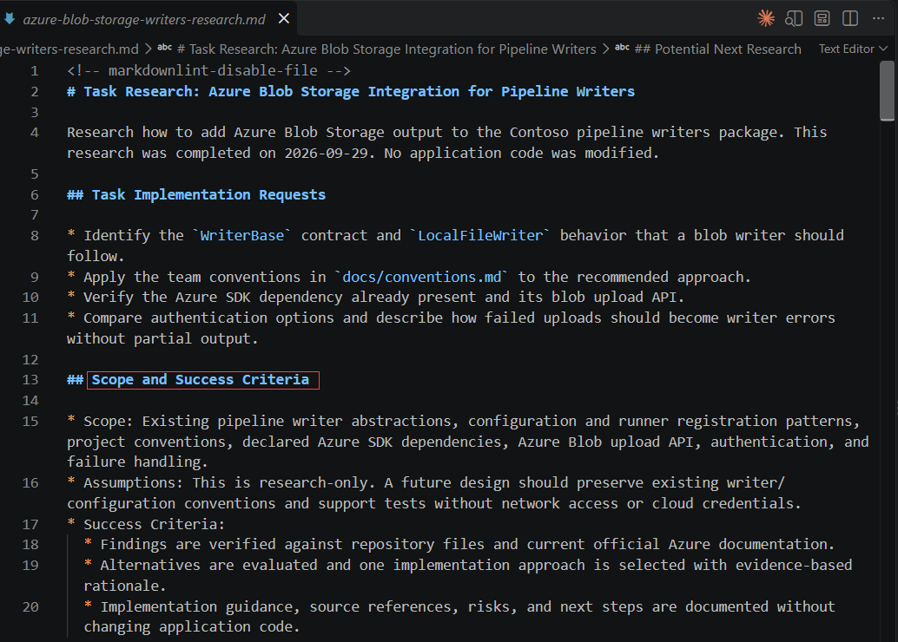

1. Scroll to any finding that references your codebase and verify the cited file. If `Ctrl + Click` does not navigate directly to the code, use Quick Open:
   - Press `Ctrl + P` to open the search bar.
   - Type the name of the file mentioned in the research document (for example, `base.py` or `local_writer.py`).
   - Press `Enter` to open it directly.

   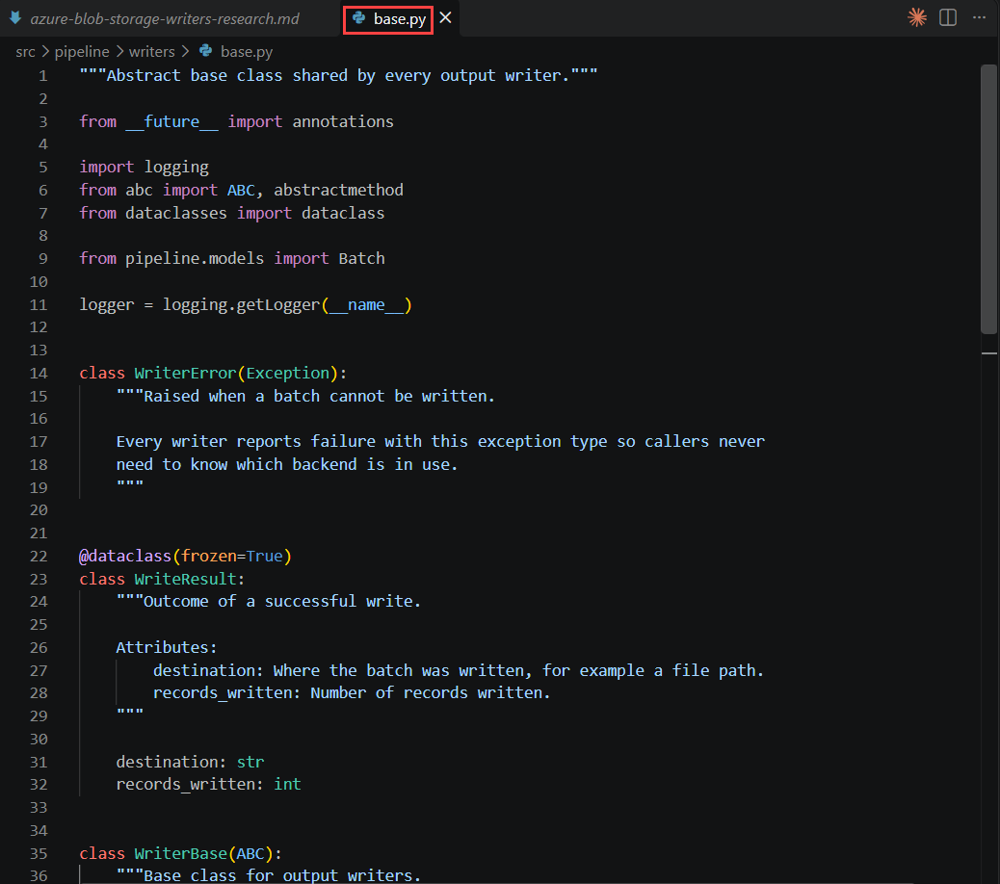

   >**Note:** Verify that the citation is accurate. This is the point of the Research phase. A finding you can trace back to a real line of code is knowledge. A finding you cannot trace is a guess, and if you find one, correct it now before it propagates into the plan.

   > **Congratulations** on completing the task! Now, it's time to validate it. Here are the steps:
   - Hit the validate button for the corresponding task. If you receive a success message, you can proceed to the next task.
   - If not, carefully read the error message and retry the step, following the instructions in the exercise guide.
   - If you need any assistance, don't hesitate to get in touch with us at cloudlabs-support@spektrasystems.com. We are available 24/7 to assist you.

   <validation step="00000000-0000-0000-0000-000000000005" />

### Task 3: Read the Evidence and the Recommended Approach

In this task, you will make sure the research document has the two things every good research document needs: **sources** for its claims, and **one clear approach**.

1. Stay in the **same chat** as Task 1. Paste this and press **Enter**:

    ```
    Update the research document you already created. Do not create a new file. Make sure it contains these two sections, each as a Markdown heading with exactly this title:

    ## Sources
    A list of at least three full https://learn.microsoft.com links for the Azure claims.

    ## Recommended Approach
    Exactly one approach. It must say that the new writer extends WriterBase and implements _write.
    ```

    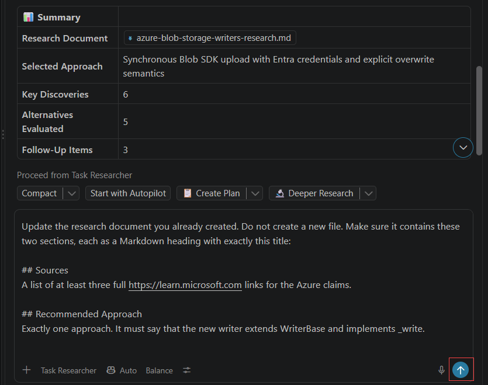

    >**Note:** Every claim in research should have a source, and the document should commit to one approach. Your document may already have both under other names. This message makes sure they exist under the same names for everyone.

1. Wait for the agent to finish. Then open the research document. If it looks unchanged, press **Ctrl+S**, or close and reopen the file.

    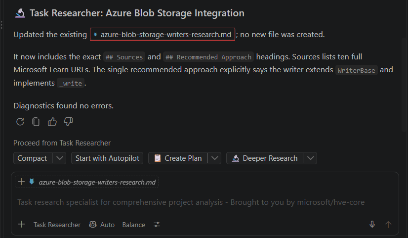

1. Press **Ctrl+F** and search for `## Sources`. Read the list of links underneath.

    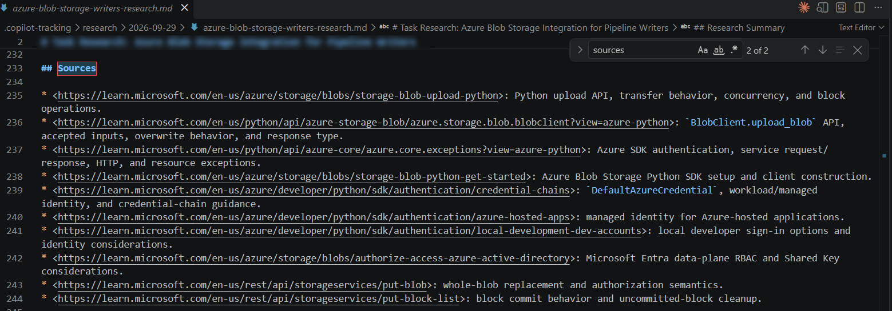

    >**Note:** Internal claims point at files and lines in this repository. External claims point at documentation links. A document without sources is just a longer guess.

1. Press **Ctrl+F** and search for `## Recommended Approach`. Read it and confirm it says the new writer **extends `WriterBase`** and **implements `_write`**.

    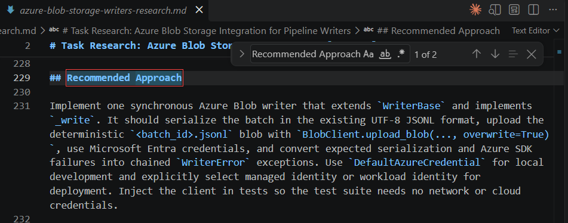

    >**Note:** This is the difference between discovered patterns and invented ones. Plain Copilot, asked to write a blob writer, would usually produce a standalone class with its own interface, because it never looked at what you already had.

    >**Note:** If either heading is missing, send the same message again.

### Task 4: Refine the Research with a Follow-up

In this task, you will add one more finding to the research. Adding it now takes one message. Finding the gap during implementation would take a rework cycle.

1. Stay in the **same chat**. Do not clear it yet.

    >**Note:** You clear the chat between phases, not within one. Refining research is still the Research phase.

1. Paste this and press **Enter**:

    ```
    How does LocalFileWriter handle write failures and partial writes? The blob writer needs to match that behaviour exactly. Add your findings to the research document you already created, as a Markdown heading titled exactly "## LocalFileWriter Failure Handling". Do not create a new file.
    ```

    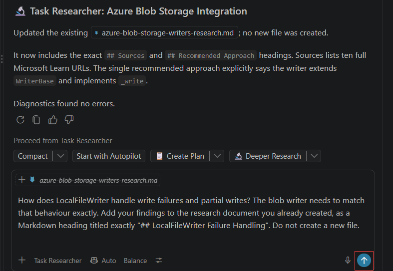

1. Wait for the agent to finish. Then open the research document. If it looks unchanged, press **Ctrl+S**, or close and reopen the file.

    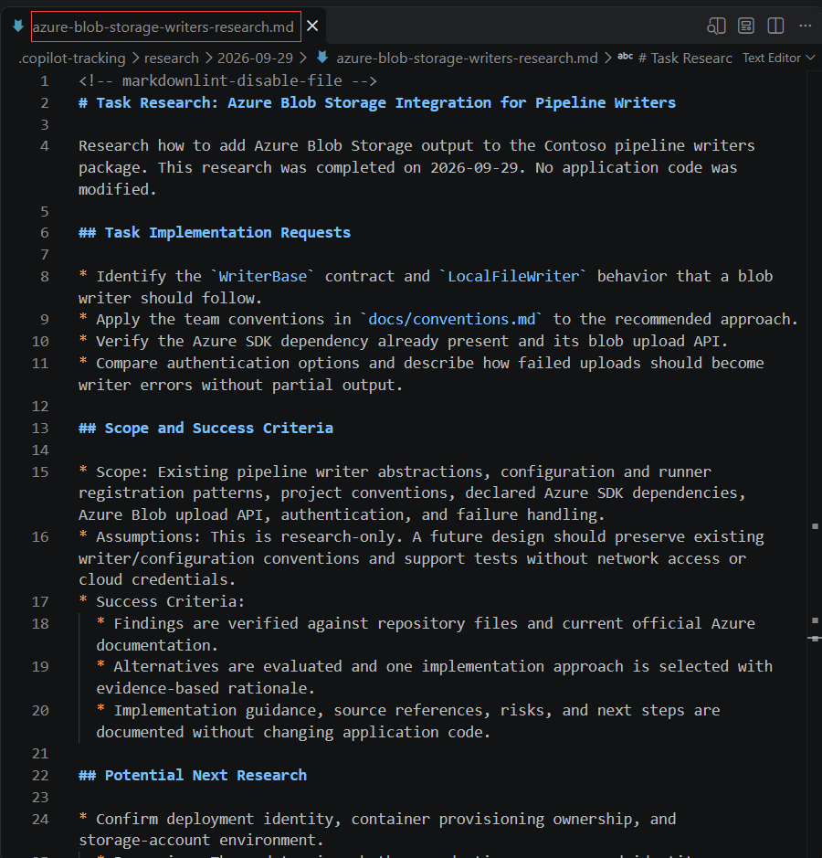

1. Press **Ctrl+F** and search for `## LocalFileWriter Failure Handling`. Read the section. It explains the temporary `.tmp` file, the rename into place, and the `WriterError` that `LocalFileWriter` raises.

    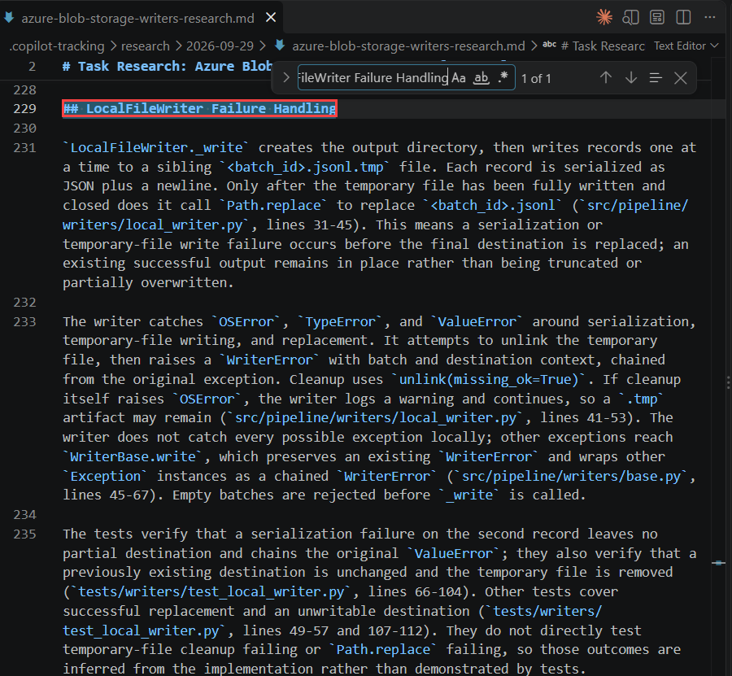

    >**Note:** If the heading is missing, send the same message again.

1. In the Explorer, open the dated folder under `.copilot-tracking/research/`. There should be only **one** file ending in `-research.md`.
    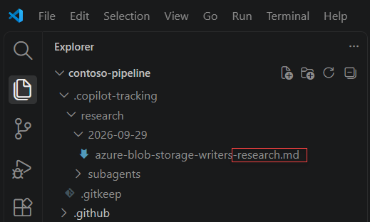

    >**Note:** If the agent created a second file, tell it to merge the content into the first file and delete the duplicate. Otherwise the Plan phase may pick the wrong file.

1. Start a fresh chat by clicking the **+** icon, or by typing **/clear**.

    

    >**Note:** The research is saved in the file, so nothing is lost. The Plan phase reads the file, not this conversation. This is what artifact-driven handoff means.


<question source="Questions/question-04.md" />

## 🧾 Summary

In this exercise, you have successfully:

- Invoked the Task Researcher agent using the `/task-research` prompt against a real backlog item.
- Observed a role-constrained agent gather evidence without writing source code.
- Located and inspected the research document in `.copilot-tracking/research/`.
- Verified findings by tracing citations back to real lines in the codebase.
- Read the single recommended approach and confirmed it aligns with the existing `WriterBase` pattern.
- Refined the research with a follow-up question covering error handling behaviour.
- Cleared the chat context in preparation for the Plan phase.

### You have successfully completed the exercise. Click **Next >>** to continue to the next exercise.


